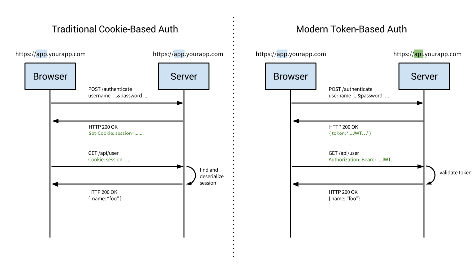
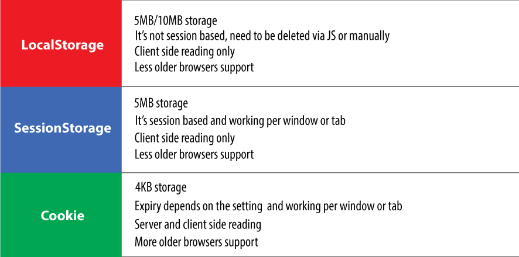
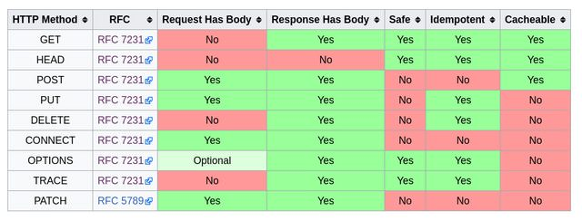

# 1. Today I Learned - Team #1's TIL(조별과제 1 조) - 2018.05.21

---

## Same-origin Policy (동일 출처 정책)

* 웹페이지에서 리소스를 불러올 때, 리소스의 출처가 웹페이지의 출처와 같으면 안전하다고 보고,<br/>
  출처가 다르면 해당 리소스는 안전하지 않다고 보는 원칙입니다.<br/>

* 여기서 '출처'란 '프로토콜 + 도메인 + 포트번호'의 결합을 가리킵니다.<br/>
  즉, 세 개가 다 같아야 동일 출처라고 할 수 있고, 셋 중에 하나라도 다르면 동일 출처로 간주되지 않습니다.<br/>

* 웹 보안의 기본 원칙으로, 웹 브라우저의 많은 요소에 적용됩니다.<br/>

<br/><br/>

## Same-origin Policy 실습 - 1

```js
const child = window.open("http://www.fastcampus.co.kr");
// 새로 열린 웹 페이지의 콘솔에서
window.foo = "bar";
// 이전 웹 페이지의 콘솔에서
child.foo;
// 출처가 같다면 접근 가능, 아니면 불가
```

<br/><br/>

## Content-Security-Policy

Content-Security-Policy 헤더를 이용하면,<br/>
동일하지 않은 출처에 대한 리소스를 불러올지 말지 결정할 수 있습니다.<br/>

<br/><br/>

## CORS (Cross-Origin Resource Sharing)

* 클라이언트 측 cross-origin 요청을<br/>
  안전하게 보낼 수 있는 방법을 정한 표준입니다.<br/>

* 쉽게 말하면, 스크립트가 전혀 다른 출처를 갖는 API 서버를<br/>
  사용하려고 하는 상황에서는 뭔가 추가적인 처리를 해주어야 합니다.<br/>

<br/><br/>

## Cross-origin 요청의 위험성

아래 상황을 가정해봅시다.<br/>
<br/>

mywebsite.com 에서 서비스 중인 웹 사이트는 mywebsite.com/api 에서<br/>
REST API 를 통해 필요한 정보를 얻습니다.<br/>
mywebsite.com/api 경로에 대한 인증은 쿠키로 이루어지고 있습니다.<br/>
<br/>

그런데 만약 evil.com 웹 사이트의 스크립트에서<br/>
mywebsite.com API 에 요청을 마음대로 보낼 수 있다면,<br/>
이미 my-website.com 도메인에 대해 브라우저에 저장된 쿠키를<br/>
이용해서 API 를 마음대로 호출할 수 있을 것입니다.<br/>

<br/><br/>

## Cross-origin 요청

* IE8 이상의 모던 웹 브라우저는 cross-origin 요청에 대해 여러가지 제한을 두고 있습니다.
* cross-origin 요청을 허용하려면, 서버가 특별한 형태의 응답을 전송해야 합니다.
* 만약 서버가 cross-origin 요청을 허용하지 않으면, 웹 브라우저는 에러를 발생시킵니다.

<br/><br/>

## CORS 에 관여하는 응답 헤더

* Access-Control-Allow-Origin
* Access-Control-Expose-Headers
* Access-Control-Max-Age
* Access-Control-Allow-Credentials
* Access-Control-Allow-Methods
* Access-Control-Allow-Headers

<br/><br/>

## CORS 에 관여하는 요청 헤더

* Origin
* Access-Control-Request-Method (preflighted 전용)
* Access-Control-Request-Headers (preflighted 전용)

<br/><br/>

## CORS - Safe, Unsafe

GET, HEAD 요청은 safe(읽기 전용)이기 때문에 서버에 요청이 도달한다고 해서<br/>
서버의 상태에 영향을 미칠 일은 없으므로, 웹 브라우저는 일단 해당 요청을 보내봅니다.<br/>
만약 서버가 cross-origin 요청을 허용한다고 응답하면 응답을 그대로 사용하고, 그렇지 않으면 에러를 냅니다.<br/>
POST, PUT, PATCH, DELETE 등의 메소드는 요청이 서버에 전송되는 것 자체가 위험하므로,<br/>
실제 요청을 보내기 전에 서버가 cross-origin 요청을 허용하는지를 알아보기 위해 시험적으로 요청을 한 번 보내봅니다.<br/>
이 요청을 preflighted request 라고 합니다.<br/>
<br/>

(단, 기존 HTML form 의 동작방식인 application/x-www-form-urlencoded 혹은<br/>
multipart/form-data 형태의 POST 요청은 preflighted request 가 발생하지 않습니다.)<br/>

<br/><br/>

## CORS with credentials

cross-origin 요청에는 기본적으로 쿠키가 포함되지 않으나,<br/>
XMLHttpRequest 혹은 fetch 를 통해서 요청을 보낼 때<br/>
쿠키를 포함시키는 옵션을 줄 수 있고 이 때 CORS 요건이 더 엄격해집니다.<br/>

(Access-Control-Allow-Credentials 헤더 설정 필요하며, Access-Control-Allow-Origin 헤더에 와일드카드 허용 안됩니다.)

<br/><br/>

## 복잡하면 그냥...

1.  프론트엔드와 API 서버를 같은 도메인으로 제공합니다.
2.  불가피하게 둘을 다른 도메인으로 제공해야 한다면

* CORS 를 허용합니다 (cors 미들웨어를 사용하면 간단함)
* CORS 를 허용하는 경우, 쿠키를 쓸 수는 있으나 보안 상 허점이 생기기 쉽고<br/>
  사용하기도 불편하므로 보통 JWT 와 같은 토큰 방식의 인증을 사용합니다.<br/>

<br/><br/>

## 쿠키의 단점

* 쿠키를 지원하는 클라이언트에서밖에 사용할 수 없습니다.
* 적절히 관리되지 않은 쿠키는 보안에 취약하며, 관리를 하려고 해도 CORS 대응이 복잡합니다.

<br/><br/>

## Token Based Auth

* 토큰이란, 사용자의 자격증명(아이디, 패스워드 등)을 통해 인증이 이루어진 후, 특정 자원에 대한 자격증명으로서 대신 사용되는 인증 수단
* 서버에 요청을 할 때마다 토큰을 요청에 직접 포함시켜서 전송합니다. (주로 Authorization 헤더에 넣어서 전송합니다.)

<br/><br/>

## Cookie VS Token



<br/><br/>

## 토큰 사용의 장점

* 다양한 인증 수단(전화번호, 공인인증서, 생체정보 등)의 인증 결과를<br/>
  토큰이라는 하나의 수단으로 통일할 수 있습니다.<br/>

* 쿠키를 지원하지 않는 클라이언트에서도 편하게 사용할 수 있습니다.

* 쿠키를 사용하지 않음으로써 CORS 관련 문제를 회피할 수 있습니다.

<br/><br/>

## 토큰 사용의 단점

* 매 요청에 토큰이 포함되게 되므로 적당히 짧은 길이를 유지해야 합니다.
* 토큰 유출에 대한 대비책이 필요합니다. (토큰에 유효기간을 두거나, 유출된 토큰을 강제로 무효화하는 등의 방법을 사용합니다.)
* 쿠키와는 다르게, 클라이언트 개발자가 직접 토큰을 저장하고 관리해야 합니다.

<br/><br/>

## Web Storage

* 브라우저에서 키-값 쌍을 저장할 수 있는 저장소
* 쿠키에 비해 사용하기 편리하고 저장 가능한 용량도 큽니다.(10MB 가량)
* 브라우저 탭이 닫히면 내용이 삭제되는 sessionStorage(임시 저장소)
* 브라우저 탭이 닫혀도 내용이 유지되는 localStrage 가 있습니다.

<br/><br/>

## Local Storage && Session Storage && Cookie



<br/><br/>

## 보안 상 주의사항

* (당연히) HTTPS 를 사용해야 합니다. (해킹방지)
* 토큰을 localStorage 에 저장하게 되면 자바스크립트로 토큰을 탈취할 수 있게 되므로,
  웹사이트에 악성 스크립트를 삽입하는 공격(XSS)에 노출되지 않도록 신경써야 합니다.

<br/><br/>

## JSON Web Token

* 최근 널리 사용되고 있는 토큰 형식의 표준입니다.
* 토큰 안에 JSON 형식으로 정보를 저장합니다.
* 보안을 위해 서명 또는 암호화를 사용할 수 있습니다.

<br/><br/>

## JWT 실습

```js
// 토큰 받아오기
let token;
axios
  .post("/auth", {
    username: "fast",
    password: "campus"
  })
  .then(res => {
    token = res.data.token;
    console.log(`token: ${token}`);
  });

// 토큰으로 요청하기 1
axios
  .get("/auth", {
    headers: {
      Authorization: `Bearer ${token}`
    }
  })
  .then(res => {
    prettyPrint(res.data);
  });

// 토큰으로 요청하기 2
axios
  .get("/some-api", {
    headers: {
      Authorization: `Bearer ${token}`
    }
  })
  .then(res => {
    prettyPrint(res.data);
  });

// 토큰으로 요청하기 3
axios
  .post("/count", null, {
    headers: {
      Authorization: `Bearer ${token}`
    }
  })
  .then(res => {
    prettyPrint(res.data);
  });

// Axios는 중복된 설정을 하지 않도록 해주는 편의도구를 제공하고 있습니다.
// 그것을 Axios instance라고 부르는데,
// 한 번 config 객체를 넘겨서 Axios instance를 생성하면 해당 instance를 통해 보내는 요청에는 config 객체가 자동으로 설정됩니다.

// Axios.create
const authedAxios = axios.create({
  headers: {
    Authorization: `Bearer ${token}`
  }
});
authedAxios.get("/auth").then(res => {
  prettyPrint(res.data);
});
authedAxios.get("/some-api").then(res => {
  prettyPrint(res.data);
});
authedAxios.post("/count").then(res => {
  prettyPrint(res.data);
});
```

<br/><br/>

## Fetch API

* 웹 브라우저의 XMLHttpRequest 를 대체하기 위해 만들어진 새로운 HTTP client 표준입니다.
* 비교적 최근에 도입되어 IE 및 구형 안드로이드 브라우저(4.x)는 지원하지 않습니다.
* Fetch Polyfill (https://github.com/github/fetch)
* isomorphic-fetch (https://www.npmjs.com/package/isomorphic-fetch)

<br/><br/>

## Axios vs Fetch API

Axios 는 여러 편의기능(instance 와 같이 설정을 재사용하거나 요청중인 연결을 취소하는 등)을 제공합니다.<br/>
다만, Axios 는 내부적으로 XMLHttpRequest 를 사용하고 있는데 Service Worker 등의 최신 기술이 XMLHttpRequest 를 지원하지 않으므로,<br/>
Service Worker 를 사용할 예정에 있는 프로젝트에서는 Axios 대신 Fetch API 를 사용해야만 합니다.<br/>

## Service Worker 공부해보기

> https://developers.google.com/web/fundamentals/primers/service-workers/?hl=ko

<br/><br/>

## PWA 도 공부해보기

> https://developers.google.com/web/fundamentals/codelabs/your-first-pwapp/?hl=ko

<br/><br/>

## Cache

컴퓨터 분야에서의 캐시는 (주로 접근 속도의 개선을 위해) 데이터를 미리 복사해 놓는<br/>
임시 저장소, 혹은 그 임시 저장소에 데이터를 저장하는 행위를 가리킵니다.<br/>
'cache' 혹은 'caching'이라는 용어 자체는 특정 기술을 가리키는 것이 아니라,<br/>
접근 속도를 개선하기 위해 따로 저장소를 두는 '방법'을 가리킵니다.<br/>
컴퓨터의 아주 많은 부분(CPU, GPU, HDD, 네트워크, 웹, 데이터베이스...)에서 사용되고 있습니다.<br/>

<br/><br/>

## HTTP Cache

* 자원의 효율적 로딩을 위한 웹 표준입니다.
* 서버에서 가져온 자원(HTML, CSS, JS, 이미지, ...)을 가까운 곳(브라우저, 혹은 다른 서버)에 저장해놓고 재사용합니다.
* 캐시를 할 것인지 말 것인지, 어떻게 할 것인지를 결정하는 규칙이 복잡하고, 브라우저마다 조금씩 다릅니다.

<br/>

* Expiration (만료) - 정해진 시간이 지나면 캐시가 자동으로 삭제되도록 설정합니다.
  (업데이트가 필요없이 지금 이대로 영원히 불변할 파일들은 만료를 무한대로 지정하여 사용할 수 있습니다.)

* Validation (검증) - 서버에 요청을 보내서 캐시를 계속 사용할 수 있는지 확인하빈다.

<br/><br/>

## Cache 관련 헤더

* Cache-Control

(요청, 응답) 캐시와 관련된 다양한 기능을 하는 지시자를 포함. no-cache, max-age 가 많이 사용됩니다.
no-cache, max-age=0 지시자는 캐시를 사용하지 않도록 하거나,
캐시를 아직도 쓸 수 있는지 검증하기 위해 사용됩니다. (각각의 자세한 의미)

* ETag

(응답) 캐시의 검증을 위해 사용되는 자원의 식별자. 주로 자원의 해시값이 사용되나,
마지막으로 수정된 시각, 혹은 버전 넘버를 사용하기도 합니다

<strong style="color:salmon">해시</strong>

해시 함수(hash function)는 임의의 길이의 데이터를 고정된 길이의 데이터로 매핑하는 함수입니다.<br/>
해시 함수에 의해 얻어지는 값은 해시 값, 해시 코드, 해시 체크섬 또는 간단하게 해시라고 합니다.<br/>
<br/>

해시의 특징<br/>

1.  값이 조금이라도 변하면 JWT 와는 다르게 결과값이 완전히 달라집니다. (입력값이 다르면 출력값도 다릅니다.)
2.  입력값의 길이가 얼마가 되었든 출력은 그 길이가 항상 일정합니다.
3.  x 로부터 h(x)의 값은 얻기 쉽지만 h(x)에서 x 를 구하기는 힘듭니다. (1-wayness 성질을 지닙니다.)

<br/>

* Expires

(응답) 캐시를 만료시킬 시각을 서버에서 명시적으로 지정합니다.

* Last-Modified

(응답) 원래 자료가 마지막으로 수정된 시각입니다.

* If-None-Match

(요청) 검증을 위해 사용됩니다. 이전에 저장해두었던 자원의 ETag 값을 If-None-Match 헤더의 값으로<br/>
요청에 포함시켜서 보내면, 서버는 해당 경로에 있는 자원의 ETag 와 비교해보고 자원의 전송 여부를 결정합니다.<br/>

* If-Modified-Since

(요청) 검증을 위해 사용됩니다. 이전에 저장해두었던 자원의 Last-Modified 값을<br/>
If-Modified-Since 헤더의 값으로 요청에 포함시켜서 보내면, 서버는<br/>
해당 경로에 있는 자원의 Last-Modified 와 비교해보고 자원의 전송 여부를 결정합니다.<br/>

아래처럼 엮어서 씁니다.<br/>
[ETag] - [If-None-Match]<br/>
[Last-Modified] - [If-Modified-Since]<br/>

<br/><br/>

## Cacheable Methods



POST 메소드는 Cacheable 범주에 포함되기는 하지만,<br/>
특별한 조건을 만족시켜야 하며 실무에서는 POST chace 가 거의 사용되지 않습니다.<br/>

<br/><br/>

## 캐시의 사용

* 브라우저는 이미 캐시를 잘 활용하도록 만들어져 있습니다.
* Express 는 이미 캐시를 잘 활용하도록 만들어져 있습니다.
* Netlify 는 이미 캐시를 잘 활용하도록 만들어져 있습니다.

일단은 별다른 추가작업 없이도 편하게 캐시 기능을 사용할 수 있지만<br/>
우리가 원하는대로 캐시가 동작하지 않을 때 그 원인을 파악하기 위해<br/>
캐시 관련 헤더는 숙지해두는 것이 좋습니다.<br/>
그리고 HTTP method 를 용도에 맞게 사용하는 것도 중요합니다.<br/>

<br/><br/>

## REST API 의 단점

* 각각의 자원마다 경로가 따로 있습니다.
  즉, 여러 자원이 동시에 필요한 경우에는 요청을 여러 번 보내야 합니다.
  (요청의 횟수 면에서 비효율적입니다.)

* (보통의 경우) 자원의 필요한 속성만 얻어올 수 없습니다.
  즉, 일부 속성의 필요하더라도 전체 속성을 가져와야만 합니다.
  (요청의 용량 면에서 비효율적입니다.)

<br/><br/>

## GraphQL

* Facebook 에서 2015 년 공개한 데이터 질의 언어입니다.
* REST API 를 대체하기 위해 만들어졌습니다.
* 클라이언트에서 필요한 데이터의 구조를 GraphQL 언어로 정의한 후 질의할 수 있고, 서버는 그에 맞게 구조화된 데이터를 응답합니다.
* 서버에서는 GraphQL 질의를 해석하기 위해 별도의 해석기가 필요하며, 여러 언어의 구현체가 나와있는 상태입니다.

<br/><br/>

# 2. Today I Found Out

```
근환 : 백엔드에 관련된 수업이 오늘로써 이론은 끝났는데
아직 감이 많이 오지 않았던 것 같습니다.
실습을 하면서 많이 사용해보고 익히면서 더 가져가야할 것 같습니다.
GraphQL과 토큰, 세션, 쿠키등.. 재밌는 요소가 많아서
조금 더 개인적으로 공부를 해보려고 합니다.

재한 : 아.. 어렵다..
하지만 뭐.. 쓰다보면 괜찮지 않을까 싶다.
오늘 배우면서 쿠키와 토큰등.. 보안관련된 것과
네트워크 기반 지식을 조금이라도 얻을 수 있어서 보람찼다.

재훈 : 어려워서 더 많은 복습이 필요할 것 같습니다.
배운 것들을 영상을 토대로 복습하고 개념을 조금 더 학습할 예정입니다.
```

<br/><br/>

# 3. refer

> https://fds9.github.io/fds-nodejs-http/

> https://developer.github.com/v4/

> https://wpsn-axios-example.glitch.me/
