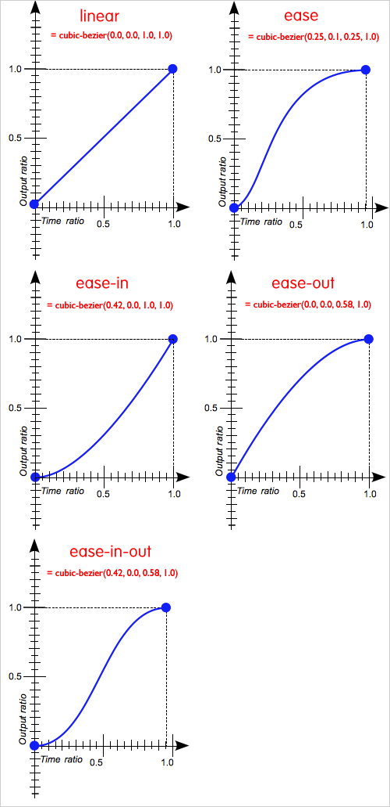

# 3조 180329 수업 내용 정리

## 1. Today I learned

### 1.1. 아웃라인 알고리즘

HTML5에선 특정 내용을 의미론적으로 구분 짓는 새로운 엘리먼트들이 등장했을 뿐만 아니라 웹 브라우저가 문서를 읽고 DOM tree를 해석하는 아웃라인 알고리즘에도 변화가 생겼다.

+ 암묵적 아웃라인 
+ 명시적 아웃라인

#### 1.1.1. 암묵적 아웃라인

HTML4에서는 HTML 구획요소(`div`)와 HTML 제목요소(`<h1>`~`<h6>`)로 섹션을 정의한다.

헤딩 레벨(`<h1>`~`<h6>`간 계급)에 따라 암묵적으로 섹션이 구분지어짐.  
단, HTML 구획요소로 그룹핑하는 것이 꼭 필요한 것은 아니다.

```html
<div class="section1">
  <h1>섹션 1</h1>
  <p>섹션 1의 문장 문장 문장</p>
  <div class="section2">
    <h2>섹션 1.1</h2>
    <p>섹션 1.1의 문장 문장 문장</p>
```
```html
  <h1>섹션 1</h1>
  <p>섹션 1의 문장 문장 문장</p>
  <h2>섹션 1.1</h2>
  <p>섹션 1.1의 문장 문장 문장</p>
```
위 두개는 암묵적으로 다음의 구조를 가진다.
```
1. 섹션 1
  1.1 섹션 1.1
```
#### 1.1.2. 명시적인 아웃라인

HTML5에서 새로 소개된 섹션을 구분 짓는 요소들(`<article>`, `<section>`, `<nav>`, `<aside>`)은, 내부에 포함된 제목 요소와 관계없이, 항상 그들이 속한 가장 가까운 상위 섹션의 바로 밑 하위 섹션으로 자리 잡게된다.

이 섹션 요소들은 외부의 헤딩 레벨에 영향을 받지 않고 헤딩 레벨을 맞추는 것은 섹션 요소 내부에서만 필요하다.   
(섹션 요소 안에서 상위 섹션의 헤딩 레벨과 관계없이 쓸 수 있다.)

단, W3C에서는 모든 브라우저(에이전트)와 보조 기술 장치에서 구현되지는 않으므로 헤딩레벨을 지켜서 쓰라고 한다. 

```html
<section>
  <h1>섹션1</h1>
  <p>섹션 1의 문장 문장 문장</p>
  <section>
    <h2>섹션1.1</h2><!-- h1 ~ h6 어느것을 써도 상관없다.-->
    <p>섹션 1.1의 문장 문장 문장</p>
  </section>
```
```
1. 섹션 1
  1.1 섹션 1.1
```

+ [HTML5 문서의 섹션과 아웃라인 - MDN](https://goo.gl/CKgubS)
+ [HTML5 개요(outline) 알고리즘 이해](http://naradesign.net/wp/2017/04/18/2382/)
+ [HTML5 아웃라인 예제](https://naradesign.github.io/html5/sections.html)

### 1.2. 네비게이션 작업

```html
    <nav class="navigation">
      <h2 class="a11y-hidden">메인메뉴</h2>
      <ul class="menu">
        <li>
          <span class="icon">HTML에 대해</span>
          <ul class="sub-menu">
            <li><a href="">HTML5 소개</a></li>
```

1. 네비게이션의 텍스트들을 텍스트로 제공할지 이미지로 제공할지 선택한다.  
2. 링크를 걸지 않을 텍스트('HTML에 대해')에 따로 스타일링 하고 싶을 때 의미는 없는 중립적 요소로 감싸준다.
  - div(block)
  - span(inline)
3. 상위 목록과 하위 목록을 각각 리스트 요소(`ul, ol > li`)로 그룹핑한다.

어떤 기능을 줄 것인지 어떤 의미를 가지는지 어떤 부모로 감싸주고 어떻게 하면 시맨틱하게 묶어줄 것인지 고민해서 콘텐츠를 마크업 하자.

#### 1.2.1. 키보드 포커싱 작업

+ 목표 : 오버(`:hover`)시에 `span`안의 텍스트 효과 준것을 키보드로 탐색했을때도 발생하게 하려함

키보드 포커스를 받지 못하는 요소에 `tabindex="0"`을 줘서 논리적인 흐름을 벗어나지 않으면서 `li`를 키보드 포커싱을 받을 수 있는 요소로 만든다.
```html
    <nav class="navigation">
      <h2 class="a11y-hidden">메인메뉴</h2>
      <ul class="menu">
        <li tabindex="0"><!-- 키보드 포커스를 받을 수 있게 한다 -->
          <span class="icon">HTML에 대해</span>
          <ul class="sub-menu">
            <li><a href="">HTML5 소개</a></li>
```
```css 
.menu span:hover,
.menu li:focus span {
  color: #ff0;
}
```

##### 1.2.1.1. 키보드 포커싱이 가능한 요소

+ `<a href="">`
+ form 요소 : input, select, button...
+ `<area>`
+ `<object>`

##### 1.2.1.2. tabindex

+ 0 : 포커스를 받을 수 있으며 순차적인 키보드 탐색으로도 접근 가능함
+ 음의 정수값 : 포커스를 받을 수는 있지만 순차적인 키보드 탐색으로는 접근 불가능
+ 양의 정수값
  - 포커스를 받을 수 있으며 동시에 순차적인 키보드 탐색으로도 접근 가능함
  - 요소의 상대적인 순서는 속성값에 의해 결정(값이 낮은 것부터 차례대로 순차 탐색)

※ 접근순서를 논리적이지 않도록 구조를 만들고 tabindex로 해결하려고 하면 유지보수가 힘들어질 수 있고 오히려 접근성을 해칠 수도 있다.

+ [키보드 접근성을 고려한 tabindex의 사용](http://nuli.navercorp.com/sharing/blog/post/1132726)
+ [tabindex 속성이 오히려 접근성을 해친다.](http://naradesign.net/wp/2009/04/07/744/)

#### 1.2.2. 커서 스타일링

※ 웹 카페 반응형 네비게이션 참고

`<span class="icon">HTML에 대해</span>`부분이 클릭할 수 있는 영역이라는 것을 보여주기 위해 마우스 포인터를 영역에 오버했을때 커서의 스타일을 정해준다.

```css
.menu span {
  /*...(생략)...*/
  cursor: pointer;
}
```

(아래 텍스트(속성값)위에 오버하면 스타일링 된 커서를 볼 수 있다.)
+ <span style="cursor: default">default</span>
+ <span style="cursor: pointer">pointer</span>
+ <span style="cursor: wait">wait</span>
+ <span style="cursor: text">text</span>

[더 많은 속성 값이 있으니 해당 문서 참고 : cursor - MDN](https://developer.mozilla.org/ko/docs/Web/CSS/cursor)

### 1.3. 배경

배경에 컬러를 넣을 수 있고, 이미지를 넣을 수 있다. 컬러와 배경 이미지를 같이 쓸 수도 있고 멀티 배경 이미지도 가능하며, 그래디언트 효과도 가능하다. 

#### 1.3.1. 배경 관련 속성

+ **background-image**: 배경 이미지 지정
  - `none(초기값) | url(<이미지 경로>)`
+ **background-position**: 배경 이미지 위치 지정
  - `0% 0%(초기값) | <키워드 값**: top, left...> | <길이 값(px, ch, cm...)> | <퍼센트 값>`
+ **background-size**: 배경 이미지 크기 지정
  - `auto auto(초기값) | <length> <percentage> | cover | contain`
  - cover: 이미지의 비율이 요소와 다른 경우 빈 공간이 남지 않도록 세로 또는 가로로 자른다.
  - contain: 가능한 한 이미지가 잘리진 않는 정도에서 큰 이미지를 보여준다.
+ **background-repeat**: 배경 이미지를 반복할지 정의
  - `repeat(초기값) | repeat-x | repeat-y | space | round | no-repeat`
+ **background-origin**: 배경 이미지 시작점 기준을 정의
  - `padding-box(초기값) | border-box | content-box`
+ **background-clip** : 배경 이미지나 컬러를 어디까지 칠할지 지정
  - `border-box(초기값) | padding-box | content-box`
+ **background-attachment**: 배경 이미지의 위치가 뷰포트 내에서 고정되어 있는지, 포함 된 블록과 함께 스크롤되는지를 결정
  - `scroll(초기값) | fixed | local`
  - scroll: 요소의 내용을 기준으로 고정, 요소 내 스크롤시 요소 내 컨텐츠와 함께 이동하지 않음
  - fixed: 뷰포트를 기준으로 고정, 스크롤 시 요소와 함께 이동하지 않음 
  - local: 요소의 내용을 기준으로 고정, 요소 내 스크롤시 요소 내 컨텐츠와 함께 이동함
+ **background-color**: 배경 컬러 정의
  - transparent(초기값) | 컬러관련 값(hsl, rgb, rgba, Hex, 컬러키워드) | currentcolor

##### 1.3.1.1 background-position

픽셀값과 퍼센트값은 이미지 위치의 동작 방식이 다르다.

+ 픽셀값으로 넣었을 때의 동작 방식(상대적인 포지션 값)

+ 퍼센트값으로 넣었을 때의 동작 방식


**관련 자료**  
+ [이미지 출처 : a primer to background positioning in css(blogs.adobe.com)](https://blogs.adobe.com/creativecloud/a-primer-to-background-positioning-in-css/)
+ [애니메이션으로 보여주는 백그라운드 동작방식 차이](https://css-tricks.com/i-like-how-percentage-background-position-works/)


#### 1.3.2. 배경 관련 속성 사용방법

##### 1.3.2.1. 개별 속성으로 정의
```css
{
  background-color: #988574;
  background-image: url("../images/normal.jpg");
  /* 아래는 배경 이미지와 관련된 속성들이다 */
  background-size: 100px 100px;
  background-repeat: no-repeat;
  background-position: 0 0;
  background-attachment: fixed
}
```
※ 이미지와 배경색을 같이 쓸 경우 배경색은 이미지 아래에 깔린다.  

##### 1.3.2.2. 속기법

```css
{
  /* 'color' 'image' 'position' / 'size' 'repeat' 'attachment' */
  background: #988574 url("../images/normal.jpg") 100% 0% / 200px no-repeat fixed
}
```
※ 다른 선언 순서는 달라도 상관없지만 포지션과 사이즈의 선언 순서는 지켜줘야한다.(`/`로 구분함)

##### 1.3.2.3. 멀티 백그라운드 방식

```css
{
  background-color: #988574;
  background-image: url("../images/normal.jpg"), url("../images/small.jpg");
  background-repeat: no-repeat; /* 둘 다 같은 값을 줄 거라면 생략해도 된다.  repeat, repeat */
  background-position: 0 0, 100% 0; /* 0은 단위를 생략하는 편이다. */
  background-size: 200px, 300px;
  background-attachment: scroll; /* scroll, scroll*/
}
```
```css
{
  background: url("../images/normal.jpg") no-repeat 0% 0% / 200px scroll, 
              url("../images/small.jpg") no-repeat 100% 0% / 200px scroll;
  background-color: #988574;
}
```
※ 멀티 백그라운드 방법에서는 컬러는 속기법으로 같이 쓸 수 없다.(따로 `background-color`로 정의)  
※ 속기법과 개별 속성 정의의 순서에 주의  
(캐스케이드에 의해 개별 속성 정의 뒤를 따르는 백그라운드 속기법은 해당 속성 값을 속기법 내 지정 속성값(없다면 초기값)으로 덮어쓴다.)

#### 1.3.3. 그래디언트 

+ linear-gradient: 선형 그래디언트
+ radial-gradient: 원형 방사형 그래디언트
+ repeating-linear-gradient: 선형 그래디언트 반복

※ `background-image`임에 주의

##### 1.3.3.1 선형 그래디언트

```css
{
  background-image: linear-gradient(red, blue);
  background-image: linear-gradient(to right, red, blue);
  background-image: linear-gradient(45deg, red, blue);
  background-image: linear-gradient(-45deg, red, blue);
  /* 여러 그래디언트 컬러를 정의할 수 있다. */
  background-image: linear-gradient(180deg, red, orange, yellow, green, blue, purple);
  /* 컬러 패턴을 만들 수 있다. */
  background-image: linear-gradient(180deg, red,red 50%, orange 50%, orange 100%);
  /* 배경이미지와 함께 사용 가능하다. 순서는 먼저 선언한 순서가 위로 온다. */
  background-image: linear-gradient(180deg, 
  rgba(255, 0, 0, .2),
  rgba(255, 0, 0, .2) 50%, 
  rgba(0, 0, 255, .2) 50%,
  rgba(0, 0, 255, .2) 100% 
  ), url('../images/normal.jpg');
  background-repeat: no-repeat, repeat;
  background-position: 0 0;
  background-size: 100%; 
}
``` 
##### 1.3.3.2 방사형 그래디언트

```css
{
  /* 원형(방사형) 그래디언트 */
  background-image: radial-gradient(green, red);
  /* 원형 그래디언트의 형태 지정 (정원, 타원)*/
  background-image: radial-gradient(circle, green, red);
  /* 원형 그래디언트 위치값 일반 적인 도형패턴처럼 사용가능 */
  background-image: radial-gradient(circle, green 50%, red 50%);
  /* at 어느쪽 기준으로 시작할지 */
  background-image: radial-gradient(circle at right top, green 50%, red 50%);
  background-image: radial-gradient(circle at 100% 0, green 50%, red 50%);
  background-image: radial-gradient(circle at 70% 20%, green 50%, red 50%);
}
```

##### 1.3.3.3. 반복 선형 그래디언트

백그라운드를 패턴처럼 사용하기 좋다.
```css
{
  background-image: repeating-linear-gradient(90deg, red, red 10%, blue 10%, blue 20%);
  background-image: repeating-linear-gradient(90deg, red, red 20%, blue 20%, blue calc(20% + 20px));
  background-image: repeating-radial-gradient(green 50px, yellow 100px);
  background-image: repeating-radial-gradient(green, green 50px, yellow 50px, yellow 100px);
}
```

+ [이쁜 그래디언트가 미리 만들어진 사이트 ](https://webgradients.com/)
+ [그래디언트로 패턴 만들어진 사이트](http://lea.verou.me/css3patterns/)

### 1.4. em vs rem

+ em
  - 부모요소의 폰트 사이즈를 기준으로 계산한다. 
  - em = 구하고자 하는 요소 px 값 / 부모 요소 폰트 사이즈 px 값
+ rem
  - 루트요소(`html`, `:root`)에 지정한 사이즈 px 값 기준으로 계산한다.
  - rem = 구하고자 하는 요소 px 값 / 루트 요소 폰트 사이즈 px 값
  - 대부분의 브라우저에서 지정하기 전의 기본 폰트 사이즈는 16px이다.

```html
<body>
  <div class="box1">폰트 사이즈</div>
  <div class="box2">폰트 사이즈</div>
</body>
```
```css
html {
  font-size: 16px;
}
body {
  font-size: 1.5em;
}
.box1 {
  font-size: 1.5em; /* 36px */
}
.box2 {
  font-size: 1.5rem; /* 24px */
}
/*
 * box1 : (16(px) * 1.5(em)) * 1.5(em) = 36px
 * box2 : 16(px) * 1.5(rem) =  24px
 /
```

+ [폰트 사이즈 계산기](https://websemantics.uk/tools/convert-pixel-point-em-rem-percent/)
+ [종합 안내: Rem 그리고 Em, 언제 써야 할까](https://goo.gl/hRGpZn)

### 1.5. line height

- `line-height` : 블록 엘리먼트에서, `line-height`는 텍스트를  싸고 있는 기본라인의 높이를 설정하는 속성을 뜻한다.
   이 값에 의해 라인 박스의 높이가 늘어나거나 줄어들곤 한다. `line-height`는 글자 크기, 글자 색상과 같은 기본속성은 상속되는 성질을 갖고있다.
   
- `line-height` 문법
    1. `normal`   - 기본값이며, 브라우저의 기본 속서을 따른다, 폰트에 따라 다르지만 보통 1.2정도 할당되어 있다

    2. `길이`     - 직접 수치를 할당 할 수있다.

    3. `숫자`     - 폰트 사이즈를 기준으로 설정한 숫자만큼 
    배율로 적용한다. 가장 문제없이 동작하고, 또 가장 선호되는 방식.

    4. `퍼센트`   - 폰트 사이즈 기준으로 설정한 퍼센트만큼 배율로 적용한다.

- `line-height`를 지정하는 방법
    ```
    1. normal
    ex)p {line-height: normal ;}
    2. 길이 단위 값(px,em 등)을 사용해서 지정.
    ex)p {line-height: 20px ;}      
    3. 숫자 값을 사용해서 지정.
    ex)p {line-height: 1.3 ;}      
    4. 퍼센트 값으로 지정.
    ex)p {line-height: 120% ;}
    ```

### 1.6. text-shadow

- `text-shadow` : 기본적으로 텍스트에 그림자를 표현하기 위한 속성이며, 콤마로 구분된 그림자 설정정보 리스트가 `text-decorations`속성에 적용될 수 있다.

- `text-shadow` 문법

    ```css
    선택자{text-shadow:offset-x, offset-y, blur-radius, color};
    ```
    `offset-x,y` : 이 둘은 필수정보이며 양수를 입력시 아래나 우측, 음수를 입력시 위쪽과 좌측에 글자가 깔리게 된다. 
    x는 수평 그림자 위치를 나타내며, y는 수직 그림자 위치를 나타낸다.

    `blur-radius` : 선택지정이며 그림자가 퍼지는 거리를 나타낸다. 기본값이 0이고 생략가능하며, 숫자가 높아질수록 점점 흐릿해진다.

    `color` : 선택지정, 그림자 색깔

    ※ 쉼표로 분리하여 여러개의 그림자를 만들 수 있다.
    ```css
    ex)
    text-shadow: 0px 1px 0px #000, 1px 0px 0 #000;
    ```

### 1.7. transition

- `transition` : transition이란 마우스를 click하거나 hover, focus같은 interection이 발생했을 때 CSS값의 변화가 지정한 시간동안 부드러운 애니메이션 효과로 표현되는것을 말한다.

- transition 문법

    ```css
    transition-property:color;  
    transition-duration: 1s;  
    transition-timing-function: ease;  
    transition-delay: .5s;  
    /* 단축 표기법 */
    transition: width 1s ease .5s; 
    transition: property, duration, -timing-function, delay;
    /* 스페이스 빈 공백으로 구분하며 편의상 (,) 를 써놨습니다. */
    ```

    `transition-property` : css 속성을 지정하며 어떤 속성에 transition 효과를 줄지를 설정한다. 모든 속성이 transition 효과를 받고 싶을때는 `all`(일일이 property를 적어주지 않아도 된다)을 선언하면 된다.

    `transition-duration` : 트랜지션 실행시간, 변화가 몇 초 , 또는 몇 밀리 세컨드애 걸쳐 일어날지를 결정짓는다. 이 속성은 항상 `transition-property`와 같이 지정해 주어야 하며 그렇지 않을 경우 기본값이 0s로 설정되는데 아무런 효과가 나타지않아 사실상 transtion을 쓰는데 의미가 없게된다.

    `transition-timing-function` : transtion 효과가 진행하는 동안 속도의 변화를 설정하는 것이며, 끝에서의 가속 곡선을 선택한다.

    ```
    ease - 처음에는 천천히 시작하고 점점 빨라지다가 마지막엔 천천히 끝남, 기본값.

    linear - 처음과 끝이 같은 속도로 transtion을 진행함.
    
    ease-in - 시작을 느리게함, 시작지점의 변화가 천천히 진행.
    
    ease-out - 끝을 느리게함, 종료지점의 변화가 천천히 진행.
    
    ease-in-out - 느리게 시작하고 느리게 끝남
    
    cubic-bezier(n,n,n,n) - 직접 함수 값을 지정할수 있으며  n에서 사용할수 있는 값은 0에서 1사이이다.
    ```

    
    
    - linear, ease, ease-in, ease-out, ease-in-out 의 cubic bezier 그래프  

    `transition-delay` : transition 효과가 언제 시작할지를 설정한다. 말 그대로, delay를 설정하는 것이며, 이 속성에서 지정하는 시간만큼 기다렸다가 트랜지션이 시작된다. 

### 1.8. animation

- `@keyframes` : 먼저 애니메이션 설명에 앞서 우리는  `@keyframes` 이 속성을 먼저 알고 들어가야한다. @keyframes는 애니메이션에서 가장 중요한 요소로써 @keyframes안에서 스테이지(구간)를 정의하고 객체가 시간의 흐름에따라 어떻게 변형될 지 모양새에 관련된 선언을 한다. @keyframes을 선언하는 방식에는 `from`. `to`, `%`가 있지만 좀더 세분화 시켜서 움직임을 표현하는 방식에는 `%`를 사용하는 것이 일반적이다.

  ```css
  @keyframes text{
  0%{
  font-size: 20px;
    }
  100%{
  font-size: 40px;
    }
  }
  ```
  - 위 코드에서는 글꼴크기 20px 에서 시작해서 100%에 다다랐을 때에는 40px로 커지게 됩니다.

- `animation` : animation은 element에 적용되는 css 스타일을 다른 css 스타일로 부드럽게 전환 시켜주는 역할을 한다. animation 속성에서는 타이밍, 지연시간, 반복, 상태 등 움직임에 관한 선언을 한다.

- animation 문법 :  
  ```css
  animation-name: text-ani;
  animation-duration: 3000ms;
  animation-fill-mode: forwards;
  animation-delay: 0s;
  animation-iteration-count: infinite;
  animation-direction: alternate;
  animation-timing-function: ease-in-out;
  animation-play-state: paused; 
  /* 단축 표기법 */
  animation: text-ani 3000ms forwards 0s infinite alternate ease-in-out;
  
  animation: name, duration, fill-mode, delay, iteration-count, direction, timing-function;

  /* 스페이스 빈 공백으로 구분하며 편의상 (,) 를 써놨습니다. */
  ```

  `animation-name` : animation 이름이며 `@keyframes` 애니메이션 이름{} 으로 쓰인다.

  `animation-duration` : animation의 진행시간을 나타내며, 시작부터 마지막까지 총 지속시간을 나타낸다.

  `animation-fill-mode` : animation이 시작되기 전이나 끝나고 난 후 어떤 값이 적용될지(상태제어) 지정한다.(none/ forwards/ backwards/ both)

  `animation-delay` : 로드 되고나서 언제 animation이 시작될지 지정하며 시작하기전에 기다려야 하는 시간이다.

  `animation-iteration-count` : animation이 몇 번 반복될지 지정하며, `infinite`로 지정하여 무한히 반복하게 할 수도있다.

  `animation-direction` : animation이 종료되고 나서 루프(loop)의 방향을 처음부터 시작할지 역방향으로 시작할지 지정한다.

  `animation-timing-function` : animation의 속도(가속/감속, 시간간격 등)를 조절하며 움직임의 긴장감, 어떻게 지정하느냐에 따라 부드러워질 수도 있고, 통통 튀는 animation을 설정할 수 있다.(linear/ ease/ ease-in/ ease-out/ ease-in-out/ cubic-bezir)

  `animation-play-state` : animation의 시작 또는 정지상태. 기본적으로 `running`, `paused`를 쓸 수 있으며 `running`이 기본 상태이다. 기본 상태 일 때, animation 지속시간과 animation 이름이 정의되면 자동으로 재생되기 시작한다. `paused`는 첫 번째 키 프레임에서 animation을 일시중지 시키는 값이다.

※ [Animate.css](https://daneden.github.io/animate.css/) 이 사이트에서 animate.css 를 다운받고 레퍼런스를 참고해 원하는 태그에 클래스만 적용되면 쉽게 사용할 수 있다.(학습용으로 참고해도 많이 도움될 것 같다)

## 2. Today I found out

- 멀티 백그라운드와 그래디언트로 다양한 효과를 줄 수 있고 패턴까지 만들 수 있다.
- `line-height`는 inline 요소를 잘 알려면 중요한 개념이다.
- 애니메이션과 트랜지션 둘 다 선택자를 선언함과 같이 `duration` 속성도 함께 써줘야 한다.
- 둘 다 속기법이 있으며, `all`을 쓰면 일일이 property를 적어주지 않아도 된다.

## 3. 오늘 읽은 자료 (혹은 참고할 링크)

- 아웃라인
  + [HTML5 문서의 섹션과 아웃라인 - MDN](https://goo.gl/CKgubS)
  + [HTML5 개요(outline) 알고리즘 이해](http://naradesign.net/wp/2017/04/18/2382/)
  + [HTML5 아웃라인 예제](https://naradesign.github.io/html5/sections.html)
- tabindex
  + [키보드 접근성을 고려한 tabindex의 사용](http://nuli.navercorp.com/sharing/blog/post/1132726)
  + [tabindex 속성이 오히려 접근성을 해친다.](http://naradesign.net/wp/2009/04/07/744/)
- background-position
  + [a primer to background positioning in css(blogs.adobe.com)](https://blogs.adobe.com/creativecloud/a-primer-to-background-positioning-in-css/)
  + [애니메이션으로 보여주는 백그라운드 동작방식 차이](https://css-tricks.com/i-like-how-percentage-background-position-works/)
- bakcground-gradient
  + [이쁜 그래디언트가 미리 만들어진 사이트 ](https://webgradients.com/)
  + [그래디언트로 패턴 만들어진 사이트](http://lea.verou.me/css3patterns/)
- em, rem
  + [폰트 사이즈 계산기](https://websemantics.uk/tools/convert-pixel-point-em-rem-percent/)
  + [종합 안내: Rem 그리고 Em, 언제 써야 할까](https://goo.gl/hRGpZn)
- animation
  + [Animate.css](https://daneden.github.io/animate.css/)