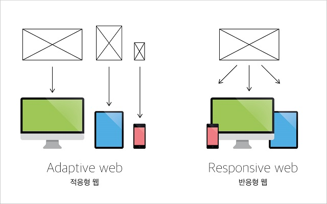
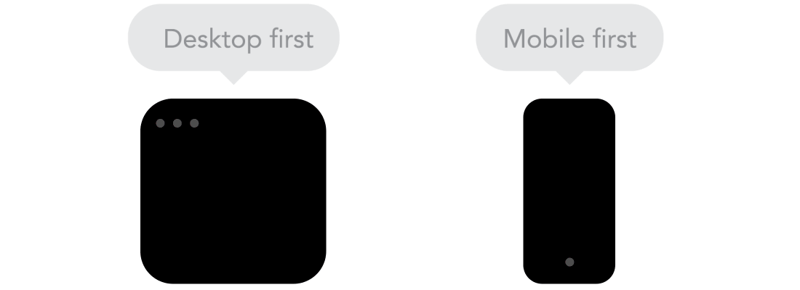
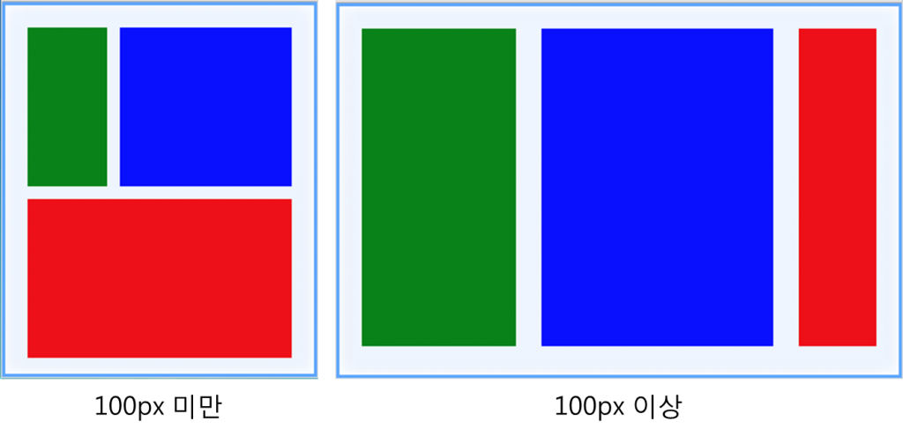

# 4 조 180405 수업 내용 정리

## 1. Today I Learned

---

### 반응형 웹의 등장

기존에는 데스크톱과 다양한 디바이스에 대응하기 위해 데스크톱 웹과 디바이스는 네이티브 앱을 이용했습니다.<br/>
하지만 여러측면에서 효율적이지 못했고 그러다가 하나의 웹을 만들어서 데스크톱과 다양한 디바이스에서 활용하기 위해<br/>
반응형 웹이 등장하게 되었습니다.<br/><br/>

```
(width)

iphones : 375px ~ 414 px
ipad : 768px ~ 1024px
Desktop : 1024px~
galexys : 360px
galexy tab : 800px
Nexus, Google : 411px
```

<br/><br/>

### 반응형 웹(Flexible Web)과 적응형 웹(Adaptive Web)

* 반응형 웹이란?

  * 하나의 웹사이트에서 PC, 스마트폰, 태블릿 PC 등 접속하는 디스플레이의 종류에 따라<br/>
    화면의 크기가 자동으로 변하도록 만든 웹페이지 접근 기법을 말합니다. (One Source Multi Use)<br/>
    반응형 웹의 핵심 기술은 가변 그리드(fluid grid), 유연한 이미지(flexible images), 미디어 쿼리(media query)등입니다.<br/>

* 적응형 웹이란?

  * 반응형 웹과 반대되는 개념으로 서버나 클라이언트에서 웹에 접근한 디바이스를 체크하여 그 디바이스에 최적화된 미리 정해 놓은<br/>
    각 디바이스의 디스플레이에 맞는 웹을 보여주는 것을 의미합니다. (디바이스에 맞춰서 대응합니다.)<br/><br/>

  

<br/><br/>

### 반응형 웹을 만든다면 모바일이 우선? 데스크탑이 우선?

반응형 웹을 위해서는 모바일을 우선적으로 고려하는 것이 좋습니다.<br/>
기술적으로 작은 화면에서 큰 화면(모바일 우선)또는 그 반대로 (데스크탑 우선) 프로젝트를<br/>
시작하면 큰 차이가 없습니다. 그러나 모바일을 처음 사용하는 경우 추가 제반 사항이 추가되고,<br/>
의사 결정을 내리는데 도움이 됩니다.<br/><br/>



<br/><br/>

### 반응형 웹 - Flexible Layout

유동형 레이아웃은 유동형 그리드와 같이 반응형 웹 기법 중 하나입니다.<br/>
레이아웃 크기를 유동형 그리드와 같이 상대적 단위로 지정하여 웹의 크기에 따라 유동적으로 변화를 줍니다.<br/>
또, 반응형 그리드와 같이 미디어 쿼리를 사용하여 일정 크기가 되면 레이아웃 구조를 바꾸어 주는 방법입니다.<br/>
특정 부분이 사라질 수 도 있고, 합쳐 지기도 하면서 유동적으로 레이아웃 구조가 바뀌며 사용자에게 제공됩니다.<br/><br/>



<br/><br/>

### 반응형 웹 - Media Queries

미디어 쿼리란?<br/>

"반응형 디자인"은 사이트가 표시되는 브라우저와 디바이스에 "반응하는" 사이트를 만드는 전략인데<br/>
미디어 쿼리는 이런 것을 가능하게 만들어주는 강력한 도구입니다.<br/>

```css
/* 마다어 쿼리 문법 */
@media not|only(연산자) media type and (media feature) - CSS 모드
<link rel=“stylesheet” media=“mediatype and|not|only (media feature)” href=“test/.css”> - HTML 모드

/* 태블릿과 데스크톱 */
@media all and (min-width: 768px) {
	CSS 코드
}
사용자 해상도가 768px 이상일 때 이 코드가 실행된다.

/* 태블릿 디바이스 */
@media all and (min-width:768px) and (max-width:1024px) {
	CSS 코드
}
사용자 해상도가 768px 이상이고 1024px 이하일 때 이 코드가 실행된다.

/* 데스크톱 디바이스 */
@media all and (min-width: 1025px) {
	CSS 코드
}
사용자 해상도가 1025px 이상일 때 이 코드가 실행된다.
```

기본적인 문법은 위와 같습니다.<br/>
이렇게 미디어 쿼리는 다양한 미디어 타입과 미디어 특징에 반응하는
CSS 디자인을 도와줍니다.<br/>

<br/><br/>

### 미디어 쿼리 - 연산자

* `and` - 여러 미디어 특징들을 하나로 결합합니다.
* `or(,)` - 쉽표로 분리된 각 목록은 각각 개별 미디어 쿼리입니다.
* `not` - 전체 미디어 쿼리를 부정하기 위해 사용 합니다.
* `only` - 미디어 쿼리를 지원하지 않는 브라우저가 주어진 스타일을 적용하는 것을 방지합니다.

<br/><br/>

### 미디어 쿼리 - 미디어 타입

* `all` : 모든 미디어 타입
* `aural` : 음성 합성장치
* `braille` : 점자 표시 장치
* `handheld` : 손으로 들고 다니면서 볼 수 있는 작은 스크린에 대응하는 용도
* `projection` : 프로젝터
* `print` : 인쇄 용도
* `screen` : 컴퓨터 스크린
* `tty` : 디스플레이 능력이 한정된 텔렉스, 터미널, 또는 수동 이동 장치등 고정 된 글자를 사용하는 미디어
* `tv` : 음성과 영상이 동시 출력 되는 장치
* `embrossed` : 페이지에 인쇄된 점자 표지 장치

<br/><br/>

### 미디어 쿼리 - 미디어 특성

* `height` : 웹페이지의 세로 길이를 판단합니다.
* `width` : 웹페이지의 가로 길이를 판단합니다.
* `device-width` : 단말기의 물리적인 가로길이를 판단합니다. 즉, 기기의 실제 가로 길이를 판단합니다.
* `device-height` : 단말기의 물리적인 세로길이를 판단합니다. 즉, 기기의 실제 세로 길이를 판단합니다.
* `orientation` : width 와 height 을 구하여 width 값이 길면 landscape(가로보기)로, height 값이 길면 portrait(세로보기)로 판단합니다.
* `aspect-ratio` : width/height 비율을 판단합니다.
* `device-aspect-ratio` : 단말기의 물리적인 화면 비율을 판단합니다.
* `color-index` : 단말기에서 사용하는 최대 색상수를 판단합니다.
* `monochrom` : 흑백 컬러만을 사용하는 단말기에서 흰색과 검은색 사이의 단계를 판단합니다.
* `resolution` : 지원하는 해상도를 판단합니다. 값으로 dip(인치당 도트 수)나 dpcm(cm 당 도트 수)를 사용합니다.
* `color` : 단말기에서 사용하는 최대 색상 수의 비트 수를 판단합니다. 자연수를 쓰지만 2 의 지수를 뜻합니다.예: 1 은 2 , 2 는 4 , 3 은 8...

<br/><br/>

### 반응형 웹 - Responsive Image

비율을 통한 반응형 이미지 img { width :100%; }로 반응형 이미지를 대체하기에는

* 이미지 크기(size)와 관련한 성능/속도 및 대역폭 문제
* 고밀집도(High-DPI) 디바이스 대응
* 소위 “아트 디렉션(art direction)” 처리
* 다양한 이미지 포맷 대응

이러한 문제들이 있습니다.

<br/><br/>
<strong style="color:salmon;">문제에 대한 대응 방법</strong>

* srcset 과 sizes 속성

처음 소개할 방법은 srcset 과 sizes 속성입니다.<br/>
이 방식은 HTML 의  ``  태그에 새로운 속성을 추가하여<br/>
반응형 이미지를 처리하는 방식으로 Apple 이 처음 제안하여 현재의 웹표준에 이른 방식입니다.<br/>

```css


/* w = width */
```

* `<picture>`  엘리먼트
  srcset/sizes 속성만으로 해결할 수 없는 문제들,<br/>
  예컨대 아트 디렉션 처리나 여러 이미지 포맷 지원 등은  `<picture>`  엘리먼트로 해결할 수 있습니다.<br/>
  `<picture>`  엘리먼트는  Mat Marquis 에 의해 처음 제안되어현재 W3C 의<br/>
  Responsive Images Community Group 에 의해 관리되는 웹표준에 이른 반응형 이미지 처리 방법입니다.<br/>

```css
<picture>
  <source media="(min-width: 40em)"
    srcset="big.jpg 1x, big-hd.jpg 2x">
  <source
    srcset="small.jpg 1x, small-hd.jpg 2x">
  
</picture>

<picture>
  <source media="(min-width: 800px)"
          sizes="80vw"
          srcset="lighthouse-landscape-640.jpg 640w,
                  lighthouse-landscape-1280.jpg 1280w,
                  lighthouse-landscape-2560.jpg 2560w">
  
</picture>
```

* 브라우저 지원과 폴리필(polyfill)
  웹에서는 아무리 좋은 기능이라도 브라우저에서 그 기술을 지원하지 않으면 무용지물입니다.<br/>
  다행히 크롬(Chrome), 사파리(Safari)등 주요 브라우저들이  `<picture>`엘리먼트와 srcset/sizes 속성을 지원하거나<br/> 또는 지원을 준비 중이며 IE 등 아직 이 기능을 지원하지 않는 브라우저를 위한 폴리필(polyfill) 자바스크립트 라이브러리도<br/>
  나와 있기 때문에 지금 당장 프로젝트에 적용하더라도 크게 무리가 없습니다.<br/>

<br/><br/>

### 오늘 수업 시간에 했던 것들

```
웹카페를 데스크탑 환경에서 모바일 환경으로 바꾸기

1.마크업(index.html)과정
1)navigation에 botton class삽입(by aria-label)
2)menu에 tabindex 지우고 대신 menu-list 삽입

2.자바스크립트(webcafe.js)과정
1)999px이하에서 나타나는 양상과 1000px이상에서 나타나는 양상을 나누어서 코딩(by if구문 사용)
2)메인메뉴 버튼을 생성(aria 사용)
3)메인메뉴 버튼을 클릭 or 키보드의 enter키를 눌렀을 떄, 해당메뉴의 +가 -로 바뀌면서 하부항목이 펼쳐지게하기(by if구문 사용)

3.CSS(style.css)과정

1)그리드토글버튼(.btn-grid)삭제
2)999px이하에서 나타나는 양상(모바일 환경)과 1000px이상에서 나타나는 양상을 나누어서 코딩(by @media screen 사용)
3)모바일 컨테이너(.container)>모바일헤더(.header)
   display: flex
   flex-direction: column
4)search버튼위치설정방법
(1) .btn-search::after에서의 position값을 absolute로 설정
(2) .btn-search에서의 position값을 relative로 설정
      width값 30px, height: 30px로 설정

5)모바일 메인메뉴 제어버튼 클릭시 모양변경(석삼자(한자)모양에서 X모양으로의 변경)방법
(1)석삼자의 맨위, 중간, 맨아래를 클릭 전후에 각각 제어해야 겠다는 아이디어에서 시작
(2)버튼클릭시 맨위의 메뉴바는 (-) -> \ 으로 바뀌게 해야함
   방법: 클릭시(.is-act .menubar-top) 45도 회전(rotate(45deg))하고, Y축 +방향(위)로 평행이동(translateY(-50%))시킴  
(3)버튼클릭시 중간의 메뉴바는 (-) -> 없어지게 해야함
   방법: 클릭시( .is-act .menubar-middle) 없어지게 해야함(translate이용, cf)overflow:hidden을 사용해도 될것 같음-내 생각)
(4)버튼클릭시 맨아래의 메뉴바는 (-) ->/ 으로 바뀌게 해야함
   방법: 방법: 클릭시(.is-act .menubar-bottom) -45도 회전(rotate(-45deg))하고, Y축 +방향(위)로 평행이동(translateY(-50%))시킴  


6)<모바일 메뉴>
제어버튼 클릭시 메인메뉴가 화면의 왼쪽에서 왼->오른 방향으로 나오게 하는 방법

클릭전 상태: 화면의 안보이는 왼쪽에 있는 상태(by translateX(-100%))
클릭을 하면:  메인메뉴가 화면의 왼쪽에서 왼->오른 방향으로 나오게 됨(by "transition: all 200ms")

cf)transition은 is-act .menu에 설정할 수도 있지만,  
의미상으로나 원칙상으로 .menu에 설정해야함
```

<br/><br/>

### jQuery 로직 주석 해설

```javascript
$(document).ready(function() {
  var viewport = window.matchMedia("(max-width:999px)"); // window.matchMedia()메소드는 미디어 쿼리 자바스크립트 버젼이라고 보면 될 것 같습니다. 변수 viewport에 값으로 할당합니다.
  if (viewport.matches) {
    // matchMedia 함수는 MediaQueryList를 반환하는데 이 객체는 media와 match를 반환합니다.
    // matches는 현재 화면이 미디어 쿼리의 범위에 들어가면 true를 반환하고 아니면 false를 반환합니다.
    var nav = $(".navigation"); // 각각의 변수에 클래스를 값으로 할당합니다. 이로 인해 변수는 클래스를 지정한 요소를 제어할 수 있습니다.
    var btn = $(".btn-menubar");
    var menu = $(".menu");
    var menuLists = $(".menu-list");
    var menuItems = $(".menu-item");
    var subMenus = $(".sub-menu");

    // 999px 이하에서 적용할 코드
    menuItems.attr("aria-haspopup", "true"); //  menuItems라는 변수에 true값이 입력된 aria-haspopup(서브메뉴의 표시여부를 나타내는 속성)이란 어트리뷰트를 부여합니다.
    menuItems.attr("aria-expanded", "false"); //  menuItems라는 변수에 false값이 입력된 aria-expanded(하위 메뉴가 펼쳐져있는지 알려주는 속성)이란 어트리뷰트를 부여합니다.
    menuItems.attr("role", "button"); // menuItems라는 변수에 값이 button인 role(해당 요소의 역할을 나타내는 속성)이란 어트리뷰트를 부여합니다.
    menuItems.attr("tabindex", "0"); // menuItems라는 변수에 값이 0인 tab-index(포커스를 받도록 해주는 속성)이란 어트리뷰트를 부여합니다.
    menuItems.addClass("icon-plus"); // 아이콘 추가를 위해 변수 menuItems에 icon-plus라는 클래스를 추가하였습니다. ( + 아이콘 )

    btn.on("click", function(e) {
      // 버튼이 클릭될때 이벤트를 실행합니다.
      e.preventDefault(); // preventDefault()메소드는 기본으로 정의된 이벤트를 작동하지 못하게 하는 메소드입니다.
      nav.toggleClass("is-act"); // nav요소에 is-act라는 새로운 클래스를 추가 혹은 제거하도록 해줍니다. (toggleClass()메소드는 해당 요소가 없으면 추가, 있으면 제거를 합니다.)
      if (nav.hasClass("is-act")) {
        // 만약 nav에 is-act 클래스가 있을경우
        btn.attr("aria-label", "메인 메뉴 닫기"); // 변수 btn에 메인 메뉴 닫기라는 값을 가진 aria-label(버튼과 같은 그래픽을 사용하는 요소를 시각화 시켜줍니다)이라는 어트리뷰트를 부여합니다.
      } else {
        // 없을경우
        btn.attr("aria-label", "메인 메뉴 열기"); // 변수 btn에 메인 메뉴 열기라는 값을 가진 aria-label이라는 어트리뷰트를 부여합니다.
      }
    });

    menuItems.on("click keydown", function(e) {
      //  menuItems에 클릭과 키입력시 이벤트를 수행합니다.
      if (e.type === "click" || (e.type === "keydown" && e.keyCode === 13)) {
        // 이벤트의 타입이 클릭인 경우 혹은 이벤트의 타입이 키코드가 13인 값을 가진 키가 눌렸을 때 아래의 내용을 수행합니다.
        menuLists.removeClass("is-act"); // 변수 menuLists의 is-act라는 클래스를 제거합니다.
        menuItems.addClass("icon-plus"); // 변수 menuItems에 icon-plus라는 클래스를 추가합니다.
        subMenus.css("display", "none"); // sebMenus에 display:none;이라는 css를 지정하여 하위 메뉴를 안보이게 합니다.
        $(this) // 또한 $(this) 선택자의 부모요소(클래스가 menu-list인 li태그)에 menu-act라는 클래스를 추가합니다.
          .parent()
          .addClass("menu-act");
        if (
          // 만약 $(this) 선택자의 부모요소가 menu-act라는 클래스를 가지고 있을경우
          $(this)
            .parent()
            .hasClass("menu-act")
        ) {
          $(this).attr("aria-expanded", "true"); // $(this) 선택자에 값이 true인 aria-expanded의 어트리뷰트를 부여합니다.
          $(this).addClass("icon-minus"); //  $(this) 선택자에 icon-minus 클래스를 부여합니다. ( - 아이콘 )
          $(this).removeClass("icon-plus"); // $(this) 선택자에 icon-plus 클래스를 제거합니다.
          $(this)
            .siblings()
            .css("display", "block"); // 또한 $(this) 선택자의 형제 선택자에 display:block;이라는 css를 지정하여 하위 메뉴를 보여주게 합니다.
        } else {
          $(this).attr("aria-expanded", "false"); // 만약 $(this) 선택자의 부모요소가 menu-act라는 클래스를 갖고 있지 않을 경우 $(this) 선택자에 값이 false인 aria-expanded의 어트리뷰트를 부여합니다.
        }
      }
    });
  } else {
    // 1000px 이상에서 사용할 코드
  }
});
```

# 2. Today I Found Out

```
이근환 : 오후에 폭풍같은 수업을 들으면서 많은 생각을 했습니다.
자바스크립트의 동적 제어가 무엇인지 느낄수 있었고,
자바스크립트로 했던 것을 CSS로도 하는 것을 보면서
CSS도 단순 장식용이라고 보기에는 강력한 기능이 많다는 것을 느꼈습니다.
다양하게 HTML, CSS, JavaScript등.. 많은 것을 잘할 수 있게 놓지않겠습니다.

김한얼 : 웹환경을 desktop에서 mobile로 바꾸었을 때
html, javascript, css에 대해 알게 되었습니다

윤도균 : 스크립트에 대한 지식이 많이 없었는데 오늘 수업내용을 정리하면서 많이 배웠습니다.

김혜민 : `jQuery` 에 대한 이해가 좀 더 높아야 할 것 같다.
이는 더 다양한 예제들을 코드에 적용시키면서 값들을 변화시키면서
`기획한 디자인에 최적화할 수 있는 방법`을 찾아보는 방식으로
`예제 풀이를 가급적 많이` 해봐야 할 듯.
```

# 3. refer

> http://ko.learnlayout.com/media-queries.html

> http://knulab.com/archives/1153

> http://mediag.com/news/popular-screen-resolutions-designing-for-all/
