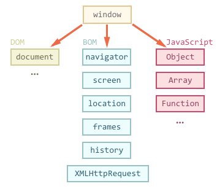
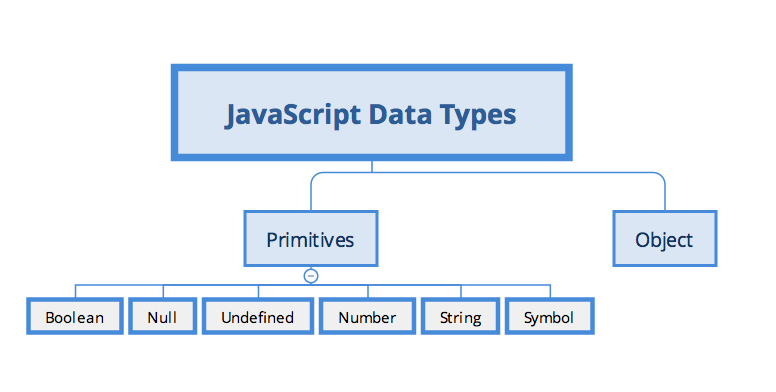
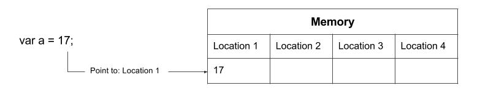
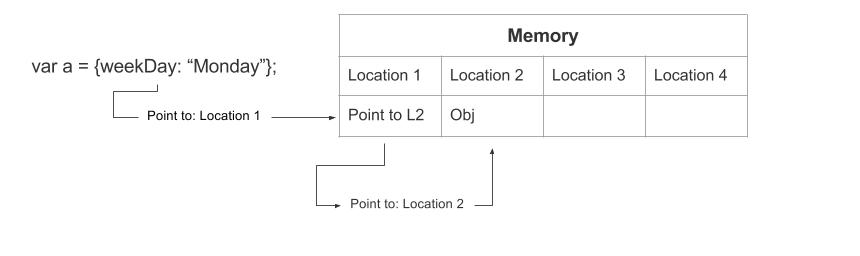
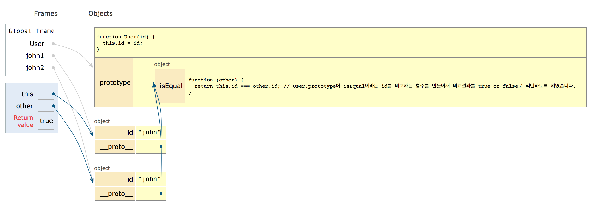

# 1. Today I Learned


---

## 프로토타입
- 프로토타입을 비교하는 것은 매우 명확하지 못합니다.
- 따라서 올바른 명령문을 사용하는 것이 중요합니다.
- 정렬의 경우 istanceOf 보다 isArray가 올바르기에 가급적 isArray를 사용하도록 합니다.

## let, const and block scope

함수에서 매개변수 scope 외에도 JS 에는 다른 종류의 스코프도 있습니다.<br/>
ES2015 에서 도입된 let,const 와 이전의 변수인 var 과는 다른 몇 가지 특징이 있습니다.<br/>
let 과 const 는 같은 일름을 갖는 변수의 재선언을 하지 않습니다.

```js
var foo = 1;
var foo = 2;  // ES2015 이전의 변수 var는 변수의 재선언이 가능했습니다.

let foo = 2;  // error : Duplicate declaration "foo"
const foo = 3; // error : Duplicate declaration "foo"

function (param) {
  let param = 1;  // error : Duplicate declaration "param"
}
```

또한 let 과 const 는 변수가 선언되기 전에 참조하려고 하면 에러가 납니다.

```js
console.log(foo);
let foo = 1;
```

당연해 보일 수도 있지만 ES2015 이전에는 위와 같이 변수를 사용해도 에러가 나지 않았습니다.<br/>
호이스팅이라는 특성을 이용하여 프로그래밍을 하기도 했지만, 호이스팅이 생각지도 못한 곳에서 발생할 경우 심각한 버그의 원인이기도 하고<br/>
가독성을 해치고, 유지보수를 어렵게 만든다는 이유 때문에, ES2015 에 들어와서 let 과 const 가 등장하게 되었습니다.<br/>
let 과 const 는 블록 스코프를 갖기에 호이스팅이 일어나지 않습니다.<br/>

```js
// 블록 안에서 선언된 변수는 외부에서 접근할 수 없습니다.
if (true) {
  let i = 0;
}
console.log(i); // ReferenceError: i is not defined
```

if, for, while, function 등의 구문을 사용하면 블록이 형성되어,<br/>
그 안에서 let 또는 const 를 통해 선언된 변수는 외부에서 접근할 수 있습니다.<br/>

```js
for (let i = 0; i < 10; i++) {
  console.log(i);
}
console.log(i); // ReferenceError: i is not defined
```

또는 특별한 기능이 없는 블록을 만들 수 있습니다.<br/>
객체와 유사하게 중괄호로 코드의 일부분을 둘러싸면 됩니다.<br/>

```js
{
  let i = 1;
}
console.log(i); // ReferenceError: i is not defined
```

<br/><br/>

## 스코프 - var 변수와 함수 스코프

ES2015 에서 let 과 const 가 등장하기 전까지 모든 변수는 var 키워드를 통해 선언되었습니다.<br/>
var 는 let 과 유사하게 값을 다시 대입할 수 있습니다. 그리고 var 는 함수의 매개변수와 유사하게,<br/>
함수 스코프를 갖습니다.<br/>
(함수 스코프란 함수내에서 유효하다는 뜻입니다.)<br/>
(let 은 블록스코프라 for 루프 조건 변수로 쓰면 루프가 끝나면 사라지는데 var 는 for 루프가 끝나도 값이 살아 있는 차이점이 있습니다.)<br/>

```js
function func() {
  var foo = 1;
}
func();
console.log(foo); // ReferenceError: foo is not defined
```

var 를 통해 선언된 변수는 let 과 const 로 선언된 변수와 다른 특징을 갖습니다.<br/>
먼저, var 를 통한 변수 선언은 같은 이름의 변수 재선언을 허용합니다.<br/>

```js
// 아무런 에러가 발생하지 않습니다.
var foo = 1;
var foo = 1;
```

그리고, var 로 선언된 변수는 내부적으로 함수 혹은 파일의 맨 위로 끌어올려지는 과정을 거치기 때문에,<br/>
같은 스코프 안에만 있다면 변수가 선언된기 전에도 해당 변수에 접근할 수 있습니다.<br/>
이를 호이스팅이라고 합니다.<br/>
단, 호이스팅이 일어나도 변수의 선언만 위로 끌어올려질뿐 대입하는 과정은 순서에 맞게 되므로,<br/>
대입이 일어나기 전에 변수의 값을 읽으면 undefined 가 불러와 집니다.<br/>

```js
function showName() {
  console.log("First Name : " + name);
  var name = "Ford";
  console.log("Last Name : " + name);
}
showName();
// First Name : undefined
// Last Name : Ford
// First Name이 undefined인 이유는 지역변수 name이 호이스트 되었기 때문입니다.
```

마지막으로 var 변수는 함수 스코프를 갖습니다.<br/>
즉, 함수가 아닌 블록에서 정의된 var 변수는 해당 블록 바깥에서도 유효할 수 있다는 말입니다.<br/>

```js
function func() {
  for (var i = 0; i <= 10; i++) {
    //...
  }
  console.log(i); //  10
}

func();
```

이 특징에 주의하지 않으면, 다중 for 문과 같은 블록이 중첩된 코드에서 의도치 않은 동작을 할 수 있습니다.<br/>

```js
for (var i=0; i<3; i++) {
  console.log('outer');
  // 위 아래 `i`변수는 같은 함수 스코프에서 정의된 같은 변수입니다.
  // 바깥쪽 루프 한 번 도는 동안, 안쪽 루프를 도느라 이미 i의 값은 3이 되어버렸습니다.
  // Uncaught SyntaxError: Unexpected identifier
  for (var i=0; i<3 i++) {
    console.log('inner');
}

// 하지만 var를 let으로 바꾼다면 정상적으로 작동합니다.
for (let i = 0; i < 3; i++) {
  console.log('outer');
  for (let i = 0; i < 3; i++) {
    console.log('inner');
  }
}
```

var 는 위와 같이 코드의 문맥과 맞지 않는 행동을 하기 때문에, 가급적 const 와 재대입이 필요할 경우에만 let 을 쓰는 것이 좋습니다.<br/>

|          | `const` | `let`  | `var`    |
| -------- | ------- | ------ | -------- |
| 스코프   | block   | block  | function |
| 재대입   | X       | O      | O        |
| 재선언   | X       | X      | O        |
| 호이스팅 | X       | X      | O        |
| 사용권장 | 1 순위  | 2 순위 | 3 순위   |

<br/><br/>

## 전역 변수 (global variable)

전역 스코프는 스코프 체인의 가장 바깥쪽에 있는 스코프입니다.<br/>

```js
let foo; // 'foo'는 전역 스코프에서 선언되었습니다.

if (true) {
  let bar; // 'bar'는 블록 스코프에서 선언되었습니다.
}
```

위 코드에서 foo 와 같이 전역 스코프에서 선언된 변수를 전역 변수라고 합니다.<br/>
변수를 명시적으로 전역 스코프에서 선안하지 않아도, 한 번도 선언되지 않은 이름으로<br/>
안쪽 스코프에서 let, const, var 를 붙여주지 않고 변수를 선언하면 전역 스코프에서 변수가 만들어 집니다.<br/>
그냥 안쪽 스코프에서 let,const,var 를 붙여주지 않고 변수를 선언한다고 뚝딱하고 만들어지는 것이 아니라<br/>
바깥쪽 스코프에 같은 변수명을 가진 변수가 있는지 확인하면서 올라가다가 최종적으로 글로벌 영역에 도달하여 전역 변수가 만들어 지는 것입니다.<br/>

```js
function func() {
  globalvar = 1;
}

func();
console.log(globalvar); //  1
```

전역변수는 코드의 어떤 부분에서든지 아무런 제한없이 접근하여 조작할 수 있습니다.<br/>
편하고 좋아보일 수 있지만 해킹이나 보안적인 측면에서 취약하며,<br/>
이러한 특성으로인해 프로그램이 커질수록 변수의 관리가 힘들어집니다.<br/>
또한 전역변수를 통해 프로그램의 많은 파일이 결합이 되어 문제되는 부분을 고쳤는데<br/>
아무 이상없던 다른 파일에서 문제가 생길수 있습니다.<br/>
변수를 선언할 때는 그 변수를 필요로 하는 작은 스코프 안에서만 접근할 수 있도록 하고,<br/>
공유되는 값에 접근할 수 있는 코드의 범위를 최소한으로 줄이며, 그 값은 약속된 방식으로만 변경을 할 수 있도록 합니다.<br/>

<br/><br/>

## 전역 객체 (global object)

JS 구동 환경은 모두 전역 객체라는 특별한 객체를 가지고 있습니다.<br/>
전역 변수가 선언되면, 이 변수는 또한 전역 객체의 속성이 되어 전역 객체를 통해서도 접근할 수 있게 됩니다.<br/>

```js
let foo = 1;

foo; //  1
window.foo; //  1 (window는 최상위 전역객체이며, 생략가능합니다.)
```

전역 객체의 이름은 JS 구동 환경마다 다릅니다.<br/>

| 구동 환경   | 전역 객체 이름 |
| ----------- | -------------- |
| 웹 브라우저 | `window`       |
| 웹 워커     | `self`         |
| Node.js     | `global`       |

전역 객체에는 구동 환경에서 유용하게 쓸 수 있는 속성과 함수가 미리 적재되어 있습니다.<br/>
예를 들어, 브라우저 환경에서는 서버와의 통신을 위한 `fetch` 함수가 미리 적재되어 있습니다.<br/>
Node.js 환경에서는, 모듈을 불러와 사용할 수 있도록 해주는 `require` 함수가 미리 적재되어 있습니다.<br/>



<br/><br/>

## 참조 (reference)

JS 에서는 모두 일곱 가지의 타입이 존재합니다.<br/>



객체인 Object 는 참조 타입, 객체를 제외한 나머지는 원시 타입이라 합니다.<br/>
이렇게 분류를 하는 이유는 둘 사이에 유의할 만한 차이점이 있기 때문입니다.<br/>
여기서 참조란, 객체가 컴퓨터 메모리 상에서 어디에 저장되었는 지를 가르키는 것입니다.<br/>
JS 에서는 우리가 참조를 직접 읽거나 조작할 수 없습니다.<br/>
하지만 언어를 이해하기 위해서 참조가 무엇인지 알아야 합니다.<br/>
우리가 객체라고 생각하고 다루어왔던 값은 실제로는 객체에 대한 참조입니다.<br/>
(참조는 메모리 안에 있는 값을 나타내는 대상이 아닌 화살표라고 생각하면 편합니다.)<br/>

```js
const obj = {}; //  변수 'obj'에는 객체에 대한 참조가 저장되었습니다.
```

객체의 속성에 접근하면, JS 엔진은 참조를 통해 메모리에 저장되어 있는 객체에 접근해서<br/>
해당 객체의 속성을 읽습니다. 이러한 동작은 역참조(dereference)라고 합니다.<br/>

```js
const obj = { prop: 1 };
obj.prop; //  'obj'를 통해 역참조된 객체의 속성을 읽어왔습니다.
```

<strong>[원시타입(number,string,boolean,null,undefined)과 참조타입(Object)의 저장방식]</strong>

<br/>
원시타입

<br/>
<br/>
참조타입


<br/><br/>

## 참조 - 함수 호출

함수 호출 시 인수는 복사되어 매개변수에 대입됩니다.<br/>
(매개변수에 값을 '대입'해도 원래 변수에 아무런 영향을 미치지 못합니다.)<br/>
만약 함수 호출 시에 객체를 인수로 넘긴다면, 이 때 역시 실제로 복사되는 것은 객체 자체가 아니라 참조입니다.<br/>
그래서 우리는 이 참조를 이용해 원본 객체 내용을 변경할 수 있습니다.<br/>
원본이나 복사된 참조나 같은 객체를 가리키기 때문입니다.<br/>
<br/>

```js
const testobj = { id: "moong2" };

function changeName(obj) {
  obj.id = "min_zzz";
}

// 변수 'testobj'에 저장되어 있는 참조가 매개변수 'obj'에 복사됩니다.
changeName(testobj);

// 참조를 통해 원본 객체의 내용을 변경할 수 있다는 것을 출력되는 값을 통해 알 수 있습니다.
console.log(testobj.id); //  'min_zzz'
```

[정리!! 변수에 원시 타입의 값만 할당되어 있는 경우 매개변수에 값을 대입해도 원래 변수에 영향을 줄 수 없지만(call by value),<br/>
객체의 경우 참조를 변경하여 값을 변경할 수 있습니다.]<br/>

```js

let a = 1;

function add (x) {
x = 2;
}

add(a);
console.log(add(a)); // 1
// 값이 복사되어서 매개변수에 전달되는 것이지,
// 변수 자체가 매개변수에 전달되는 것은 아닙니다.
// 그래서 매개변수에 값을 대입해도, 원래 변수에는
// 아무런 영향도 미치지 못합니다.
```

<br/>
<br/>

* 변수에 원시 타입의 값이 할당되어 매개변수의 값으로 넘어갈 때

  * 인수(arguments)로 값(value)이 넘어옵니다.
  * 값이 넘어올 때 복사된 값이 넘어옵니다.
  * caller 가 인자를 복사해서 넘겨줬으므로 callee 에서 해당 인자를 지지고 볶아도 caller 에는 아무런 지장이 없습니다.

```js
var a = 1;
var func = function(b) {
  // callee
  b = b + 1;
};
func(a); // caller
console.log(a); // 1
```

<br/>

* 변수에 객체가 값으로 할당되어 매개변수의 값으로 넘어갈 때

  * 인수(argument)로 참조(reference)를 넘겨줍니다.
  * 참조를 넘기다보니 해당 참조가 가리키는 값을 복사하지는 않습니다.
  * caller 가 인자를 복사해서 넘기지 않았으므로 callee 에서 해당 인자를 가지고 지지고 볶으면 caller 에도 영향을 받습니다.

```js
var a = {};
var func = function(b) {
  // callee
  b.a = 1;
};
func(a); // caller
console.log(a.a); // 1
```

<br/>

<strong>[JavaScript 는 call by value? call by reference?]</strong>

결론부터 말하자면 자바스크립트는 항상 Call by value 이며, 객체나 배열같은 참조형(reference) 타입인 경우에도<br/>
실제로는 복사본을 만들어 value 로 function 에 파라미터를 전달하게 되는 것입니다.<br/>
그래서 function 으로 넘겨받은 파라메터안에 있는 해당 속성들의 값은 변경이 가능해도 막상 자기자신의 값을 초기화해서<br/>
다시 새로운 값으로 할당받을 수 없는 것입니다.<br/>

<br/><br/>

## 참조 - 객체와 같음

지금까지 우리는 `===` 연산자를 통해 두 값이 같은지를 판별해왔습니다.<br/>
그런데 객체에 대해서는 비교 연산 역시 이상하게 동작합니다.<br/>
내용이 같은 두 객체를 `===` 연산자를 통해 비교해도, 결과값은 false 로 나옵니다.<br/>

```js
{prop: 1} === {prop: 1}; //  false
[1,2,3] === [1,2,3];    //  false
```

위의 등호 연산자 역시, 객체의 내용을 비교하는 것이 아니라 객체의 참조를 비교합니다.<br/>
우리는 생성자나 리터럴을 이용해 객체를 생성하면, 객체는 매 번 새로 생성되어 각각 메모리를 다른 위치에 저장합니다.<br/>
그래서 내용이 똑같아 보이는 두 객체일지라도 그에 대한 참조는 서로 다른 것입니다.<br/>
<br/>
당연하게도, 두 참조가 같은 객체를 가리키고 있다면 등호 연산자는 true 를 반환합니다.<br/>

```js
let a = [1, 2, 3];
let b = a;
console.log(a === b); // true
```

프로그램 작성시, 객체에 대한 비교를 하는 코드를 짜게된다면 객체의 내용을 비교하려 하는 것인지,<br/>
객체의 참조를 비교하려고 하는 것인지 생각해야합니다.<br/>
객체의 내용을 비교하고 싶다면 fast-deep-equal(https://www.npmjs.com/package/fast-deep-equal)을<br/>
사용하거나 정확히 어떤 내용을 비교할지를 가지고 함수 혹은 메소드를 작성하여 비교하도록 합니다.<br/>

```js
// 계정 관리 시스템에서는, 사용자의 '아이디'가 같다면 같은 사용자라고 볼 수 있습니다.
function User(id) {
  this.id = id;
}

User.prototype.isEqual = function(other) {
  return this.id === other.id; // User.prototype에 isEqual이라는 id를 비교하는 함수를 만들어서 비교결과를 true or false로 리턴하도록 하였습니다.
};

const john1 = new User("john");
const john2 = new User("john");

john1 === john2; //  false  : 얼핏보기에는 같은 값을 부여받은 것 같지만 객체가 아닌 참조이기에 저장되는 메모리를 생각하면 john1과 john2는 다릅니다.
john1.isEqual(john2); // true
```



<br/><br/>

## 참조 - 불변성 (immutability)

원시 타입의 값 자체의 내용을 변경할 수 있는 방법은 없습니다.<br/>
(기본 데이터를 원시 데이터라고 하며 number, string, boolean, null, undefined 를 말합니다.)<br/>
이런 성질을 불변성이라고 하고, JS 의 원시 값은 불변이라고 말합니다.<br/>
예를 들면 문자열을 변형하는 메소드는 모두 기존 문자열의 내용을 바꾸는 것이 아니라 새 문자열을 반환합니다.<br/>
다른 원시 타입의 메소드들도 마찬가지입니다.<br/>

```js
const str = "Hello Javascript World~^!";

str.replace("!", "^"); //  'Hello Javascript World~^^'
str.slice(0, 3); //  'Hel'
str.toLowerCase(); //  'hello javascript world~^!'

console.log(str); // 'Hello Javascript World~^!'
```

변수에 저장된 원시 타입의 값을 바꾸려면, 오직 변수에 다른 값을 대입하는 방법(재대입)밖에 없습니다.<br/>

원시 타입을 인수로 해서 함수로 호출할 때에는, 원본이 변경될지도 모른다는 걱정을 할 필요가 없습니다.<br/>
값이 불변일 뿐더러, 애초에 함수 호출시에는 값이 복사되어서 전달되기 때문에 원본을 변경할 수 있는 방법이 아예 없습니다.<br/>

```js
let str = "Hello World";

function immortal(a) {
  // 여기서 어떠한 짓을 해도, 'str'에 새 값을 대입하지 않는 한 원본을 변경할 수 있는 방법은 없습니다.
}

immortal(str);
```

객체의 경우를 생각해보면, 객체 자체의 내용을 변경할 수 있는 방법이 얼마든지 많습니다.<br/>
따라서 객체는 가변입니다.<br/>
(원시타입은 불변 / 객체는 가변)<br/>
<br/>
가변인 값은 어디서 어떻게 변경될 지 알 수 없습니다.<br/>
변경되지 말아야 할 객체가 있다면, 정말로 변경되지 않도록 신경써서 코드를 작성해야 합니다.<br/>
그러나 객체가 정말로 변경되지 않았는지를 확인하는 일은 쉽지 않아서, 객체의 가변성때문에 프로그래밍이 어려워지기도 합니다.<br/>
<br/>
이러한 객체의 가변성을 해결할 두가지 방법이 있습니다.<br/>

1.  `Object.freeze`의 사용

    * Object.freeze 는 객체를 얼려서 속성의 추가/변경/삭제를 막습니다.

    ```js
    const obj = { prop: 1 };

    Object.freeze(obj);

    // 이제 obj는 얼려졌으므로 아래 코드는 모두 무시됩니다.
    obj.prop = 2;
    obj.newProp = 3;
    delete obj.prop;

    console.log(obj); //  { prop : 1 }
    ```

    다만 Object.freeze 를 호출한다고 해서 객체 안에 객체까지 얼려버리지 않기에,<br/>
    중첩된 객체에는 Object.freeze 를 사용하기가 조금 까다롭습니다.<br/>

2.  `Immutable.js` 같은 라이브러리의 사용

    * `Object.freeze` 처럼 객체를 얼려버리지는 않지만, 객체를 마치 불변인 것처럼 다룰 수 있는 방법을 제공합니다.<br/>
      다시 말하면 이 객체들은 메소드를 통해 내용이 조금이라도 변경되면, 아예 새로운 객체를 반환합니다.<br/>
      즉, 내용이 달라지면 참조 역시 달라지게 되어 객체의 내용이 변경되었는지를 확인하는 작업이 쉬워집니다.<br/>

    ```js
    import { List } from "immutable";

    // Immutable.js에서 제공하는 `List`는 배열과 유사하지만, 불변인 것처럼 다룰 수 있는 자료구조입니다.

    const list = List.of(1, 2, 3); // [1,2,3]

    const newList = list.push(4); // [1,2,3,4]

    // 내용이 달라지면, 참조도 달라집니다.

    list === newList; //  false
    ```

    특히 React 생태계에서는 immutable.js 가 널리 사용되니, 살펴보는게 좋습니다.<br/>

    <br/>

마지막으로, `const`와 불변성을 잘 구분해야 합니다.<br/>
const 는 '한 번 초기화 된 변수에 다른 값을 대입할 수 없다'는 제약을 걸어주는 것이고, 불변성은 '값 자체가 변하지 않는다'는 것입니다.<br/>
예를 들어서 const 로 선언된 변수에 객체를 대입하면, 이 변수에 새로운 값을 대입할 수는 없지만 이 객체의 내용은 얼마든지 변경할 수 있습니다.<br/>
즉, 재대입이 불가능일지라도 가변일 수 있습니다.<br/>

```js
const obj = {};

obj.a = 1; // 객체는 가변이므로 내용을 바꿀 수 있습니다.
console.log(obj); //  1

obj = 1; // error : obj는 const로 선언되었으므로, 다른 값을 대입할 수 없습니다.
```

<br/><br/>

## 래퍼 객체 (wrapper object)

원시 타입의 값은 객체가 아님에도 불구하고, 원시 타입에 점 표기법을 써서 메소드를 호출하거나 속성을 읽어올 수 있는데,<br/>
이는 JS 가 래퍼 객체라는 기능을 제공하기 때문입니다.<br/>
<br/>
원시 타입의 값에 대해 속성을 읽으려고 하면, 그 값은 그 순간에만 객체로 변환되어 마치 객체인 것처럼 동작합니다.<br/>

```js
const s = "hello";
s.toUpperCase(); //  'HELLO'
s.length; //  5

const n = 1.2345;
n.toFixed(2); //  1/23

const b = true;
b.toString(); //  'true'
```

다음은 래퍼 객체를 생성시키기 위해 사용되는 생성자들의 목록입니다.<br/>

* String
* Number
* Boolean
* Symbol

위 생성자들을 이용해 우리가 직접 객체를 생성할 수도 있습니다.<br/>
하지만 직접 객체를 생성해주지 않아도 원시 타입의 값에 대해 메소드를 호출하거나 속성을 읽을 수 있기 때문에, 직접 객체를 생성해줄 일은 없습니다.<br/>

```js
const stringObj = new String("hello"); //  생성자의 인수로 원시 타입의 값을 넘겨주면 됩니다.

stringObj.toUpperCase(); //  'HELLO'
stringObj.length; //    5

const string = stringObj.valueOf(); //  다시 원시 타입으로 돌아가기 위해 'valueOf' 메소드를 호출합니다.
```

아래는 생성자를 통해 객체를 생성하여 빈 문자열을 값으로 주는 것과 그냥 빈 문자열과 차이점을 보여주는 예시입니다.<br/>

```js
const str = new String("")

!!str // true
!!"" // false
str.a = 1
str.a // 1
```

<br/><br/>

# 2. Today I Found Out

```
이근환 : 이제 기초적인 부분이 끝나고 심화로 들어가는 첫 날이였는데 매우 설레면서도 긴장이 됬던 것 같습니다.
        앞으로 더 중요한 내용이 많이 나오는데 미리 준비해서 수업을 잘 따라가도록 하겠습니다.

김상혁 : 기존의 문자열 메소드를 사용할때 내용을 바꾸는 줄 알았지만 사실은 기존의 문자열의 내용을 바꾸는 메소드는 
       절대 없다는것을 알게 되었다. 문자열의 내용을 바꾸는것이 아닌 새 문자열을 반환하는 메소드이며 문자열과 다르게 
       배열의 메소드들은 안의 내용을 직접적으로 수정할 수 있다는것을 알게되었다.
       옛날에 다른 언어들을 조금씩 배워논것들이 겹쳐지게 생각하는 습관을 버려야 할 것 같다. 
       새로운 언어를 배우는만큼 그 언어에 익숙해져야 하는데, 다른데선 됐는데 왜 JS에선 안되지라는 생각을 멀리하고 
       항상 새롭게 배우는느낌으로 JS에 익숙해지도록 열심히 공부해야겠다.

김영빈 : 드디어 실전 문제에 돌입했다. 밑바닥부터 코딩하지 않는 것을 다행으로 여겨야 할 만큼 코딩을 하는 것, 
       문제를 해결하는 것은 쉬운 일이 아닌 것 같다 역시. 손을 키보드에 두기보다 펜과 종이로 먼저 움직여야겠다.

김혜민 : 함수, 블록 스코프 부분에 대해서 다시 정리할 필요가 있는 것 같다. 
       '참조'를 한다는 개념에 대해 다시 한번 생각해 볼 수 있는 하루였다. 
       마냥 '그렇지' 라고 생각했던 부분에 대해 정확하게 집어주시니 개념 정리에 도움이 되었던 것 같다.
```

<br/><br/>

# 3. refer

> http://dev.epiloum.net/1035

> https://helloworldjavascript.net/pages/220-value-in-depth.html

> https://blog.perfectacle.com/2017/10/30/js-014-call-by-value-vs-call-by-reference/

> http://programmer-seva.tistory.com/35

> https://developer.mozilla.org/ko/docs/Glossary/Hoisting

> http://pyrasis.com/nodejs/nodejs-HOWTO/

> https://helloworldjavascript.net/pages/285-async.html
