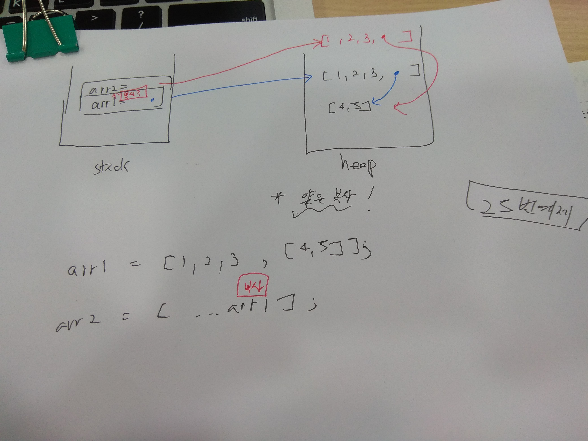

# 조별 과제 0423

## 표현식(Expression)

- **값**으로 변환될 수 있는 부분

- 리터럴 / 연산자 / 기타

- **평가** : 표현식을 실제 해당 값으로 변환하는 과정

- Javascript는 텍스트를 메모리에 올림

```js
1 + 2 

// 1을 메모리에 생성
// 2를 메모리에 생성
// 더함
```

```js
true && false  

//위의 경우에는 처음에 falsy이면 뒤에 값을 평가조차 안함
//위의 방식을 Short-circuit Evaluation 이라고 함
```

## Short-circuit Evaluation

```js
false && expression
true || expression
```

> falsy이면 그 뒤에 expression은 **평가조차 하지 않음**
>
>truthy이면 그 뒤에 expression은 **평가조차 하지 않음**
>


## 증가 감소 연산자

```js

let num = 10;
console.log(num++); // num = 10
console.log(++num); // num = 11
```

> 위에 예제는 두개가 다름
> 
> num++은 우선 1) **평가** num =10을 해서 출력한 뒤 2) **증가**를 시킴
>
> ++num 은 우선 1) **증가를** 시키고 2)**평가**를 함 n=11
>

<br>

### 비교 해보기!

```js
let i = 3;
while (i--) {
  console.log('감소 연산자를 뒤에 쓰면 어떻게 될까요?');
}

// 3번 실행 i--; i = 3 
// i --; i =2
// i --; i =1
// i -- ; i = 0 ; falsy 정지!

let j = 3;
while (--j) {
  console.log('감소 연산자를 앞에 쓰면 어떻게 될까요?');
}
```

<br>


```js
function Counter(initial = 0) {
  this._count = initial;
}

// `this._count`를 1 증가시키면서도 증가시키기 전 값을 반환하는 코드를,
Counter.prototype.longInc = function () {
  const result = this._count;
  this._count += 1;
  return result;
}

// 아래와 같이 짧게 쓸 수 있습니다.
Counter.prototype.inc = function() {
  return this._count++;
}

```

### 할당 연산자 '='

- x = x + 5

- 할당연산자의 뜻: 왼쪽에 오른쪽의 연산을 대입한다

### 연산자 결합 순서

- 연산자에 따라 연산자 계산 순서가 다르다


```js
// 위아래 식은 완전히 같은 방식으로 동작합니다.
1 + 2 + 3 + 4 + 5
(((1 + 2) + 3) + 4) + 5

// 왼쪽부터 결합되어, 처음으로 등장하는 falsy 값이 표현식의 결과값이 됩니다. 나머지는 평가되지 않습니다.
a && b && c && d;
((a && b) && c) && d;

// 왼쪽부터 결합되어, 처음으로 등장하는 truthy 값이 표현식의 결과값이 됩니다. 나머지는 평가되지 않습니다.
a || b || c || d;
((a || b) || c) || d;

```

<br>

> 위의 코드는 왼쪽부터 실행되는 연산자를 나타낸다
>
> 아래의 예시 코드는 오른쪽부터 실행되는 연산자의 예시이다(제곱연산자, 할당연산자)
>

<br>

```js
// 위아래 식은 완전히 같은 방식으로 동작합니다.
2 ** 2 ** 3; // 256
2 ** (2 ** 3); // 256

// 위아래 식은 완전히 같은 방식으로 동작합니다.
let x, y, z;
z = y = x = 1
z = (y = (x = 1))

// 위아래 식은 완전히 같은 방식으로 동작합니다.
a ? b : c ? d : e ? f : g
a ? b : (c ? d : (e ? f : g))

```

#### Quick Side-note

- `If-else`구문은 표현식이 아니므로 변수에 대입 불가
- `삼항연산자` 는 표현식이므올 변수에 대입이 가능하다


### 추상적 동일성 (Abstract Equality)

- 피연산자를 비교할떄 `==`을 통해 비교한다. `==`은 피연산자의 타입을 변환하여 비교한다.

```js
'1' == 1; // true
true == 1; // true
false == 0; // true
'' == false; // true
```

- 그러나 null check을 할때 만큼은 `==`을 이용하여 비교한다.

>null과 undefined 두 값을 동일한 것으로 취급합니다. 즉, 결과값이 true가 된다.
>
>null과 undefined를 이 두 값을 제외한 다른 값과 비교했을 때는 항상 결과값이 false가 된다.


```js
null == undefined; // true

null == 0; // false
null == ''; // false
undefined == false; // false
undefined == NaN; // false
```


 ### 엄격한 동일성 (Strict Equality)

 - `===`, `!==` 연산자는 두 피연산자의 타입이 다른 경우 무조건 false를 반환한다.
 
 - 그러나 `NaN`은 ===에 대해 자기자신값을 비교해도 false 가 나온다

 - 이럴 때는 `isNaN`을 이용하여 검사한다.

 - 혹은 `Object.is(A, B)`통해서도 두 값의 동일성을 비교할 수 있다.

```js
Object.is(NaN, NaN); // true
Object.is(0, -0); // false
```

### Spread Syntax

- Spread 문법을 사용하면 **배열(혹은 객체)**을 다른 배열(혹은 객체)에 쉽게 **삽입**할 수 있다.

```js
const arr1 = [3, 4];
const arr2 = [1, 2, ...arr1, 5]; // arr2 = [1,2,3,4,5] 안에 배열이 없음

//비교하기

const arr3 = [ 6,7];
const arr4 = [9, 10, arr3]; // output: [9,10, [6,7]] 안에 배열이 생김!

```

> 참고할 점은 ...(Spread Syntax)를 쓰면 얕은 복사로 된다는 점이다.
>
> `얉은 복사` 아래 이미지에 표시
>

<br>

 

```js
const arr = [1, 2, 3, 4, 5];

// 아래 코드는 `Math.max(1, 2, 3, 4, 5)`와 동일
Math.max(...arr); // 5
```

> 위의 결과 값이랑 동일하게 값을 낼 수 있는 함수는 flatten이 있는데 `lodash` 라이브러리를 가져와 이용하면 객체 및 배열을 좀더 손 쉽게 다룰 수 있다.

<br>

- [link to lodash library](https://lodash.com/)

<br>

<br>

```js
const obj1 = {prop: 1};
const obj2 = {...obj1};

// 이전에는 같은 작업을 하기 위해 `Object.assign` 정적 메소드를 사용했습니다.
Object.assign({}, obj1);

```

> 객체에 대해서도 똑같은 작업을 실행할 수 있다.
>

## 분해대입

```js

const [a, b, c] = [1, 2, 3];

console.log(a, b, c); // 1 2 3

```

>말 그대로 분해하여 대입하는 것을 분해대입이라고 한다.
>
> 배열 중첩에 대해서도 분해대입가능함

```js

const [a, b, [c, d]] = [1, 2, [3, 4]];

console.log(a, b, c, d); // 1 2 3 4


// OR

const [a, b, ...c] = [1, 2, 3, 4, 5]; // Spread Syntax 이용

console.log(c); // [3, 4, 5]
```

### 객체 분해대입

- 조금어려움


```js
const {a: prop1, b: prop2} = {a: 1, b: 2};

console.log(prop1, prop2); // 1 2


//OR

const {a, b} = {a: 1, b: 2};

console.log(a, b); // 1 2
```

<br>

> {속성이름: 변수 이름} = {속성이름 : 값}
>
> 값이 변수 이름에 대입이 됨
>
 

 ## DOM API

 - Document Object Model, 문서 객체 모델

    - [DOM](https://developer.mozilla.org/en-US/docs/Web/API/Document_Object_Model)

    - [DOM Tree](
  https://helloworldjavascript.net/pages/282-data-structures#%ED%8A%B8%EB%A6%AC-tree
)
 - JS를 통해 브라우저를 조작

 - API: JS같은 언어를 통해 무언가를 다룰떄 사용하는 함수, 속성 

 - 브라우저 안에 있는 것은 모든 게 **객체** 이기 떄문에 메소드 혹은 속성 값이 존재한다. 이를 통해 브라우저를 조절하게 된다.

 - el. : element의 줄임말으로 브라우저 안에 객체를 말함

<br>

 #### API VS Library

 - 라이브러리: *코드 모음*

 - API: 라이브러리를 *사용하는 방법*(메소드 등)의 모음

 - 이벤트: 1) **사용자가 어떤 행동** 2) **브라우저가 어떤 동작**

 

### Query Selector

- 선택자: CSS를 통해 조절하는 모든 값(태그, class, id)등을 가져와서 객체로 만들어주는것!


<br>
<br>

### innerHTML VS textContent

```js
const divEl = document.querySelector('div');
divEl.textContent = html;

const mainEl = document.querySelector('.main');
mainEl.innerHTML = html; //아래 주의와 같이 절대 이렇게 하지 말것! 해커에게 사용자 정보를 위험하게 할가능성!!!
```

## **주의**: 사용자에게 입력받은 텍스트를 innerHTML에 대입해오는 것은 자살행위이다!!

<br>

### 엘리먼트 Attribute 조작 VS Class 조작

- attribute: 속성값으로 불리우지만, 자바스크립트에서 속성값은 객체안에 key-value pair를 의미하므로, 이것과 별개로 HTML과 CSS에서 태그, class, id등을 일컷는 것으로 생각하자

#### Attribute 조작

- el.hasAttribute
- el.getAttribute
- el.setAttribute
- el.removeAttribute 

  - class를 제외한 모든 attribute 조작한다고 생각

#### Class를 통한 조작 

- el.classList.add
- el.classList.remove
- el.classList.contains

  - class는 많은 값을 가지므로 위의 방법을 통해 class를 조절한다고 생각하자


### 노드를 추가하여 DOM tree에 넣기!

 ```js

 document.createElement('a');

 const anchorEl = document.createElement('a');

 ```

 <br>

> 위의 코드를 통해 생성된 a 태그가 생성되어 메모리상에 올라가있지만 DOM tree안에 추가는 **안되어있다.**
>
>el.insertBefore 나 el.appendChild 를 통해서 DOM Tree에 추가할 수 있다.
>

### 이벤트 

- 이벤트를 addEventListener / removeEventListener 를 통해 조절 가능하다. 

- 이벤트란 마우스 click, 키보드를 누른다 keydown 등의 사용자가 어떤 행동을 하거나 브라우저가 어떤 동작을 하는 것을 의미한다.

