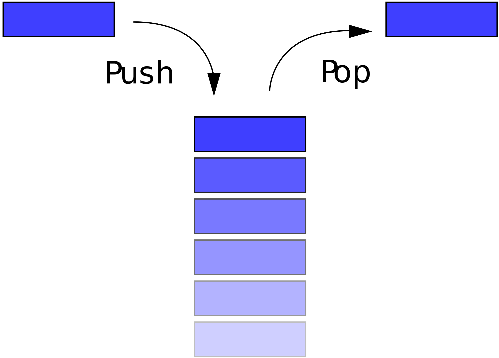

# 1. Today I Learned - 조별과제 1 조 - 2018.05.14

## JavaScript Queue, Stack, Tree

---

어떤 데이터의 구체적인 구현 방식은 생략한 채,<br/>
데이터의 추상적 형태와 그 데이터를 다루는 방법만을 정해놓은 것을 가지고, ADT 혹은 추상 자료형이라고 합니다.<br/>

<br/>

## 큐(Queue)

큐(Queue)는 다음과 같은 성질을 갖는 자료형입니다.

* 데이터를 집어넣을 수 있는 선형(linear) 자료형입니다.
* 먼저 집어넣은 데이터가 먼저 나옵니다. 이를 FIFO (First In First Out) 또는 선입선출이라고 합니다.
* 데이터를 집어넣은 euqueue, 데이터를 추출하는 dequeue 등의 작업을 할 수 있습니다.


<br/>

큐에서는 가장 앞에 있는 요소를 전단(Front), 가장 뒤에 있는 요소를 후단(Rear)라고 합니다.<br/>
큐는 선입선출이라고 말씀드렸듯이 제거는 전단에서 이루어지며, 삽입은 후단에서 이루어집니다.<br/>
배열로 쉽게 큐를 구현을 해보자면 다음과 같습니다.<br/>

```js
// 큐 정의
class Queue {
  constructor() {
    this._arr = [];
  }
  // 데이터를 넣는 euqueue는 후단에서 삽입됩니다.
  enqueue(item) {
    this._arr.push(item);
  }
  // 데이터를 추출하는 dequeue는 전단에서 이루어집니다.
  dequeue() {
    return this._arr.shift();
  }
}

const queue = new Queue();
queue.enqueue(1);
queue.enqueue(2);
queue.enqueue(3);
queue.dequeue(); // 1
```

이처럼 큐는 순서대로 처리해야 하는 작업을 임시로 저장해두는 버퍼(buffer)로서 많이 사용됩니다.<br/>
<br/>

[활용예시]

* OS 에서 프로세스 스케줄링엥 우선순위 큐를 활용할 수 있습니다.<br/>
* 공유 컴퓨터에서 작업 순서를 계획할 때, 최대 우선순위 큐는 실행할 작업과 상대 우선순위를 계속 기억하고 있습니다.<br/>
  한 작업이 끝나거나 중단될 때, Extract-max 를 이용하여, 대기중인 작업 중 가장 우선순위가 높은 작업을 선택합니다.<br/>
  새로운 작업은 insert 를 사용하여 큐에 새로 들어갈 수 있습니다.<br/>

<br/><br/>

## 스택(Stack)

스택(Stack)은 다음과 같은 성질을 갖는 자료형입니다.

* 데이터를 집어넣을 수 있는 선형(linear) 자료형입니다.
* 나중에 집어넣은 데이터가 먼저 나옵니다. 이 특징을 줄여서 LIFO(Last In First Out) 또는 후입선출이라고 부릅니다.
* 데이터를 집어넣는 push, 데이터를 추출하는 pop, 맨 나중에 집어넣은 데이터를 확인하는 peak 등의 작업을 할 수 있습니다.



<br/>

스택은 후입선출(LIFO)라는 특징을 가졌다고 말씀드렸다시피 입력과 삭제가 후단에서 모두 이루어집니다.<br/>
배열로 쉽게 스택을 구현해보면 다음과 같습니다.<br/>

```js
// 스택 정의
class Stack {
  constructor() {
    this._arr = [];
  }
  // 데이터를 넣는 enqueue는 후단에서 삽입됩니다.
  push(item) {
    this._arr.push(item);
  }
  // 후입선출이기에 데이터를 추출하는 dequeue는 후단에서 아루어집됩니다.
  pop() {
    return this._arr.pop();
  }
  peek() {
    return this._arr[this._arr.length - 1];
  }
}

const stack = new Stack();
stack.push(1);
stack.push(2);
stack.push(3);
stack.pop(); // 3
```

이처럼 스택은 서로 관계가 있는 여러 작업을 연달아 수행하면서 이전의 내용 작업을 저장해 둘 필요가 있을 때 널리 사용됩니다.<br/>
<br/>

[활용예시]

* 재귀 프로그램
* 서브루틴(특정 작업을 수행하는 명령어 세트) 호출시 복귀 주소 저장
* 수식 계산(Prefix, Infix, Postfix)
* DFS(깊이 우선 탐색, Depth-First Search), Preorder(전위 순회)
* Quick Sort(퀵 정렬)

<br/><br/>

## JavaScript Async

---

## Motivation - 타이머 API

웹 브라우저에는 함수를 특정 시간이 지난 뒤에 실행시키거나,<br/>
혹은 함수를 주기적으로 실행시키는 작업을 할 수 있게 해 주는 함수가 내장되어 있습니다.<br/>

```js
// 함수를 2000 밀리세컨드(2초)가 지난 뒤에 실행시킵니다.
setTimeout(() => {
  console.log("setTimeout이 실행된 지 2초가 지났습니다.");
}, 2000);

// 함수를 3000 밀리세컨드(3초)마다 주기적으로 실행시킵니다.
setInterval(() => {
  console.log("3초마다 출력됩니다.");
}, 3000);
```

setTimeout 과 setInterval 은 각각 타이머 식별자를 반환합니다.<br/>
이 식별자를 가지고 실행 중인 타이머를 취소할 수 있습니다.<br/>

```js
const timeoutId = setTimeout(() => {
  console.log("setTimeout이 실행된 지 2초가 지났습니다.");
}, 2000);

const intervalId = setInterval(() => {
  console.log("3초마다 출력됩니다.");
}, 3000);

// clearTimeout을 하게되면 setTimeout를 취소할 수 있습니다.
clearTimeout(timeoutId);
// clearInterval을 하게되면 setInterval를 취소할 수 있습니다.
clearInterval(intervalId);

// 아무것도 출력되지 않습니다.
```

### 타이머 사용시 주의할 점

setTimeout 과 setInterval 은 정확한 지연시간을 보장해 주지 않습니다.<br/>

```js
const start = new Date();

setTimeout(() => {
  console.log(new Date() - start);
}, 100);

// 실제로 실행시키면 100,101,102,103등..
// 실제 지연시간과 약간의 차이가 존재합니다.
// 시계를 위의 함수로 구현할 경우 인지하지 못할 정도지만 시간이 틀어지는 현상이 생깁니다.
```

또한 지연시간을 0 으로 주었을 때는 코드가 기대한대로 동작하지 않습니다.<br/>
setTimeout 호출 시 지연시간으로 0 을 넘기면 어떻게 되는지 확인해보겠습니다.<br/>

```js
setTimeout(() => {
  console.log("hello");
}, 0);

console.log("world");

// 출력 결과:
// world
// hello
```

분명 지연시간을 0 으로 주었는데도 코드가 뒤늦게 실행되었습니다. 어떻게 된 일일까요?<br/>
이를 이해하기 위해서는 먼저 브라우저에서 JavaScript 코드가 실행되는 과정을 알아야 할 필요가 있습니다.<br/>

<br/><br/>

## 브라우저의 JavaScript 코드 실행 과정

### 호출 스택 (Call Stack)

호출 스택(call stack)은 스택 형태의 저장소로, JavaScript 엔진은 함수 호출과 관련된 정보를 이 곳에서 관리합니다.<br/>
아래의 코드에 대한 호출 스택을 그림으로 나타내보면 다음과 같습니다.<br/>

```js
function add(x, y) {
  return x + y;
}

function add2(x) {
  return add(x, 2); // `add`를 호출
}

function add2AndPrint(x) {
  const result = add2(x); // `add2`를 호출
  console.log(result); // `console.log`를 호출
}

add2AndPrint(3); // `add2AndPrint`를 호출
```

<strong style="color:salmon; font-size:20px;">(실행 흐름) add2AndPrint -> add2 -> add -> add2 -> add2AndPrint -> log -> add2AndPrint</strong><br/>

호출 스택에 저장되는 각 항목을 실행 맥락(타 프로그램에서는 스택 프레임이라고도 표현)(execution context)이라고 부릅니다.<br/>
실행 맥락에는 아래와 같은 정보들이 저장됩니다.<br/>

* 함수 내부에서 사용되는 변수
* 스코프 체인
* this 가 가리키는 객체

브라우저가 JavaScript 코드를 실행시킬 때, 호출 스택을 다음과 같이 조작합니다.<br/>

* 함수가 호출되면, 해당 호출에 대한 실행 맥락을 생성해서 호출 스택에 추가(push)합니다.<br/>
* 변수에 대입이 일어나면, 호출 스택에 저장되어 있는 변수의 내용을 변경합니다.<br/>
* 함수의 실행이 끝나면, 결과값을 반환하고 호출 스택 가장 위에 있는 실행 맥락을 제거(pop)합니다.<br/>
* 스크립트를 불러올 때, 전역 실행 맥락(global execution context)을 호출 스택에 추가합니다.<br/>
  스크립트의 실행이 모두 끝나면, 전역 실행 맥락을 호출 스택에서 제거(pop)합니다.<br/>

이를 통해, 변수에 값을 대입한다거나, 함수가 여러 번 중첩되어 호출되는 등의 복잡한 코드의 동작을 단순한 자료구조로 표현할 수 있게 됩니다.<br/>

웹 브라우저는 호출 스택에 실행 맥락이 존재하는 동안, 즉 실행 중인 함수가 존재하는 동안에는 먹통이 되어 버립니다.<br/>
브라우저는 대개 60fps 로 동작하기 때문에, 대략 16ms 안에 코드의 실행을 완료하지 못하면 브라우저의 애니메이션이 뚝뚝 끊기는 현상이 나타납니다.<br/>
이는 사용자 경험에 악영향을 미칠 수 있습니다.<br/>

```js
// 특정 시간동안 계속 루프를 도는 코드
function sleep(milliseconds) {
  const start = Date.now();
  while (Date.now() - start < milliseconds);
}

sleep(5000);
// 5초 동안 while 루프가 실행되므로, 호출 스택이 비워지지 않고 브라우저는 먹통이 됩니다.
```

따라서, 브라우저에서 동작하는 JavaScript 코드,<br/>
특히 사용자와의 상호작용을 위한 코드를 작성할 때에는 코드의 실행 시간이 얼마나 될지를 항상 염두에 두어야 합니다.<br/>

<br/><br/>

### 작업 큐 (Task Queue)

하지만 모든 작업을 16ms 안에 처리할 수는 없습니다.<br/>
어떤 사건(event)이 일어날 때까지 기다리거나, 혹은 큰 데이터에 대한 계산이 완료될 때까지 기다리는 데에는 시간이 오래 걸리기 마련입니다.<br/>

이런 경우, 브라우저에서는 다음과 같은 절차를 통해 오래 기다려야 하는 일을 처리할 수 있습니다.<br/>

* 기다려야 하는 일을 JavaScript 엔진에서 직접 처리하는 것이 아니라 API 를 통해 브라우저에 위임합니다.<br/>
  (호출 스택에서 브라우저 단으로! - 기다려야 하는 일들을 위임)<br/>
  이 때, 일이 끝나면 실행시킬 콜백을 같이 등록합니다.<br/>
* 위임된 일이 끝나면, 그 결과와 콜백을 작업 큐(task queue)에 추가합니다.<br/>
  (브라우저단에서 작업 큐로! - 기다리는 일이 끝났을 경우 작업 큐로 결과와 콜백을 추가)<br/>
* 브라우저는 호출 스택이 비워질 때마다 작업 큐에서 가장 오래된 작업을 꺼내와서 해당 작업에 대한 콜백을 실행시킵니다.<br/>
  (작업 큐에서 다시 호출 스택으로! - 작업 큐에서 오래된 작업을 꺼내와서 콜백 실행)<br/>
  브라우저는 이 과정을 끊임없이 반복하는데, 이를 이벤트 루프(event loop)라고 부릅니다.<br/>

    

JavaScript 코드를 작성할 때에는, 호출 스택과 작업 큐의 성질을 반드시 염두에 두어야 합니다.<br/>

* 각 작업은 작업 큐에 쌓인 순서대로 실행됩니다.<br/>
* 이미 작업 큐에 작업이 쌓여있다면, 뒤늦게 추가된 작업은 앞서 추가된 작업이 모두 실행된 다음에,<br/>
  즉 호출 스택이 비워진 다음에야 실행됩니다.<br/>
* 호출 스택이 비워지지 않는다면, 작업 큐에 쌓여있는 작업을 처리할 수 없습니다.<br/>
* 각 작업 사이에 브라우저는 화면을 새로 그릴 수 있습니다.<br/>
  즉, 호출 스택이 비워지지 않는다면 브라우저는 화면을 새로 그릴 수 없습니다.<br/>

[그냥 알고만 가기][만약에 js처럼 단일스레드(콜스택이 한개인것)가 아니면 웹에서 여러개를 처리할 수 있을까?]<br/>

자바같은 경우 멀티스레드(콜스택이 여러개)입니다.<br/>
SW 개발같은 경우 CPU 의 코어를 여러개를 활용하여 여러함수를 실행시킬수 있지만<br/>
웹같은 경우는 브라우저 자체가 코어(콜스택)가 하나밖에 없기 때문에<br/>
여러개를 실행할 수 없습니다. 하나만 사용가능합니다.<br/>
하지만 웹 워커라는 스크립트와는 독립적으로 백그라운드에서 실행되는 javascript 를 쓴다면<br/>
웹에서도 멀티스레드 구동이 가능합니다.<br/>

<br/>
앞서 지연시간으로 0 을 넘겨준 setTimout 예제를 다시 한 번 보겠습니다.<br/>
지연시간을 0 으로 주면, 브라우저는 setTimeout 에 넘겨진 콜백을 바로 실행하는 것이 아니라 그 콜백을 작업 큐에 등록합니다.<br/>
호출 스택이 비워지면, 그제서야 작업 큐에 들어있는 콜백을 가져와서 실행시킵니다.<br/>
이 때문에 hello 가 나중에 출력되는 것입니다.<br/>

```js
setTimeout(() => {
  console.log("hello");
}, 0); // 작업 큐에 콜백이 추가됨

console.log("world");
```

<br/><br/>

## 비동기 프로그래밍 (Asyncronous Programming)

이처럼 어떤 일이 완료되기를 기다리지 않고 다음 코드를 실행해 나가는 프로그래밍 방식을 일러<br/>
비동기 프로그래밍(asynchronous programming)이라고 합니다.<br/>
반대로 어떤 일이 완료될 때까지 코드의 실행을 멈추고 기다리는 프로그래밍 방식을 동기식 프로그래밍(synchronous programming)이라고 부릅니다.<br/>
<br/>

브라우저에서의 비동기 프로그래밍은 주로 통신, 계산과 같이 오래 걸리는 작업들을 브라우저에 위임할 때 이루어집니다.<br/>
<br/>

비동기 프로그래밍 방식은 대개 프로그램의 성능과 응답성을 높이는 데에 도움을 줍니다.<br/>
하지만 코드가 실제로 실행되는 순서가 뒤죽박죽이 되므로, 코드의 가독성을 해치고 디버깅을 어렵게 만든다는 비판을 받아왔습니다.<br/>
이런 문제를 해결하기 위해 비동기 프로그래밍을 위한 여러 기법이 생겨났고, 또 어떤 것들은 JavaScript 언어 자체에 포함되기도 했습니다.<br/>
여기에서는 근래 JavaScript 생태계에서 자주 사용되는 몇 가지 비동기 프로그래밍 기법들을 살펴 보겠습니다.<br/>

<br/><br/>

### 콜백 (Callback)

콜백은 다른 함수의 인수로 넘기는 함수를 말하는데, 이 콜백을 가지고 비동기 프로그래밍을 할 수 있습니다.<br/>

```js
const $ = require("jquery");
const API_URL =
  "https://api.github.com/repos/facebookincubator/create-react-app/issues?per_page=10";

$.ajaxSetup({
  dataType: "json"
});

$.get(API_URL, issues => {
  console.log("최근 10개의 이슈:");
  issues.map(issue => issue.title).forEach(title => console.log(title));
  console.log("출력이 끝났습니다.");
});

console.log("받아오는 중...");
```

위 예제에서 $.get 메소드의 두 번째 인수로 콜백을 넘겨주었습니다.<br/>
$.get 메소드는 비동기식으로 동작하며, Github API 서버와 통신하는 일을 브라우저에 위임한 후 바로 종료됩니다.<br/>
통신이 끝나면, 그 결과를 첫 번째 인수로 해서 콜백을 호출하게 됩니다.<br/>
<br/>

여기서 주의할 것이 있습니다. 콜백을 인수로 받는 함수가 항상 비동기식으로 동작하는 것은 아닙니다.<br/>
위 예제의 map, forEach 의 인수로 넘겨준 것 역시 콜백이지만, 이 때에는 콜백이 동기식으로 호출됩니다.<br/>
즉, 콜백의 실행이 끝날때까지 코드의 실행 흐름이 다음으로 넘어가지 않습니다.<br/>
예제 코드를 직접 실행해본 후, 어떤 순서로 출력이 되었는지 살펴보세요.<br/>
<br/>

콜백은 JavaScript 가 고차함수를 잘 지원한다는 특징 때문에 가장 많이 사용되는 비동기 프로그래밍 양식이었습니다.<br/>
하지만 콜백만으로는 복잡한 비동기 데이터 흐름를 표현하기가 어려워서 많은 프로그래머들이 힘들어했고,<br/>
결국 콜백 지옥(callback hell)이라는 용어까지 생겨났습니다.<br/>
<br/>

예를 들어, 아래의 흐름대로 데이터를 가져오기 위해서는 복잡한 형태로 콜백을 사용해야 합니다.<br/>

1.  Github 에 공개되어있는 저장소 중, 언어가 JavaScript 이고 별표를 가장 많이 받은 저장소를 불러온다.
2.  위 저장소에 가장 많이 기여한 기여자 5 명의 정보를 불러온다.
3.  해당 기여자들이 최근에 Github 에서 별표를 한 저장소를 각각 10 개씩 불러온다.
4.  불러온 저장소를 모두 모아, 개수를 센 후 저장소의 이름을 개수와 함께 출력한다.

```js
const $ = require("jquery");
const API_URL = "https://api.github.com";
const starCount = {};

$.ajaxSetup({
  dataType: "json"
});

// 1. Github에 공개되어있는 저장소 중, 언어가 JavaScript이고 별표를 가장 많이 받은 저장소를 불러온다.
$.get(
  `${API_URL}/search/repositories?q=language:javascript&sort=stars&per_page=1`,
  result => {
    // 2. 위 저장소에 가장 많이 기여한 기여자 5명의 정보를 불러온다.
    $.get(
      `${API_URL}/repos/${result.items[0].full_name}/contributors?per_page=5`,
      users => {
        let repoArrs = [];
        for (let user of users) {
          // 3. 해당 기여자들이 최근에 Github에서 별표를 한 저장소를 각 기여자마다 10개씩 불러온다.
          $.get(`${API_URL}/users/${user.login}/starred?per_page=10`, repos => {
            repoArrs.push(repos);
            // 4. 불러온 저장소를 모두 모아, 개수를 센 후 저장소의 이름을 개수와 함께 출력한다.
            if (repoArrs.length === 5) {
              for (let repoArr of repoArrs) {
                for (let repo of repoArr) {
                  if (repo.full_name in starCount) {
                    starCount[repo.full_name]++;
                  } else {
                    starCount[repo.full_name] = 1;
                  }
                }
              }
              console.log(starCount);
            }
          });
        }
      }
    );
  }
);

console.log("fetching...");
```

위의 2, 3 번 과정은 한 비동기 작업이 끝난 후 다른 비동기 작업을 시작하고 있고, 이를 위해 콜백 안에서 다시 콜백을 사용하고 있습니다.<br/>
또한 4 번 과정을 실행하기 위해서는 앞서 3 번 과정에서 실행된 10 개의 비동기 작업이 모두 끝나는 시점을 알아야 할 필요가 있기 때문에,<br/>
repoArrs 배열의 길이를 체크하고 있습니다.<br/>
<br/>

이처럼 순수하게 콜백만 사용했을 때는, 데이터 흐름이 조금만 복잡해져도 코드가 복잡해지는 문제가 생깁니다.<br/>
<br/>

### Promise

위에서 설명한 콜백의 문제를 해결하기 위해 여러 라이브러리들이 등장했고, 그 중에서 개발자들에게 널리 선택받은 것이<br/>
바로 Promise 패턴을 사용한 라이브러리들(jQuery Deffered, Q, Bluebird)이었습니다.<br/>
이 라이브러리들이 표준화되어, 결국 ES2015 에 이르러 JavaScript 언어 자체에 포함되게 되었습니다.<br/>
<br/>

Promise 는 '언젠가 끝나는 작업'의 결과값을 담는 통과 같은 객체입니다.<br/>
Promise 객체가 만들어지는 시점에는 그 통 안에 무엇이 들어갈지 모를 수도 있습니다.<br/>
대신 then 메소드를 통해 콜백을 등록해서, 작업이 끝났을 때 결과값을 가지고 추가 작업을 할 수 있습니다.<br/>
<br/>

Promise 객체를 생성하는 가장 쉬운 방법은 Promise.resolve 정적 메소드를 사용하는 것입니다.<br/>

```js
const p = Promise.resolve(1);
```

위 코드에서 1 이라는 결과값을 갖는 Promise 객체를 생성했습니다.<br/>
그러나 이 코드는 비동기 작업을 하고 있지는 않습니다.<br/>
<br/>

비동기 작업을 하는 Promise 객체는 Promise 생성자를 통해 만들 수 있습니다.<br/>

```js
const p = new Promise((resolve, reject) => {
  setTimeout(() => {
    console.log("2초가 지났습니다.");
    resolve("hello");
  }, 2000);
});
```

Promise 생성자는 콜백을 인수로 받습니다.<br/>
이 콜백의 첫 번째 인수로 resolve 함수가 들어오는데,<br/>
콜백 안에서 resolve 를 호출하면 resolve 에 인수로 준 값이 곧 Promise 객체의 궁극적인 결과값이 됩니다.<br/>
<br/>

두 번째 인수로 들어오는 reject 함수는 비동기 작업에서 에러가 발생했을 때 호출하는 함수입니다.<br/>
<br/>

위 예제에서는 setTimeout 을 이용해 2 초가 지난 뒤에 콜백이 실행되도록 했습니다.<br/>
즉, p 변수에 저장된 Promise 객체는 2 초 동안은 결과값이 없는 상태가 됩니다.<br/>
그리고 2 초가 지나면, resolve 함수가 호출되어 p 객체는 결과값을 갖는 객체가 됩니다.<br/>
<br/>

Promise 객체의 결과값을 사용해 추가 작업을 하려면 then 메소드를 호출해야 합니다.<br/>
then 메소드에 콜백을 넘겨서, 첫 번째 인수로 들어온 결과값을 가지고 추가 작업을 할 수 있습니다.<br/>
<br/>

```js
p.then(msg => {
  console.log(msg); // hello
});
```

then 메소드에는 아주 중요한 특징이 있는데, 바로 then 메소드 자체도 Promise 객체를 반환한다는 것입니다.<br/>
이 때, 콜백에서 반환한 값이 곧 Promise 의 결과값이 됩니다.<br/>

```js
const p2 = p.then(msg => {
  return msg + " world";
});

p2.then(msg => {
  console.log(msg); // hello world
});
```

위 코드는 아래와 같이 줄여 쓸 수 있습니다.

```java
p.then(msg => {
    return msg + " world";
  })
  .then(msg => {
    console.log(msg);
  });
```

또한, then 메소드에 넘겨준 콜백에서 Promise 객체를 반환하면,<br/>
then 메소드가 반환한 Promise 객체는 앞의 Promise 객체의 결과를 따르게 됩니다.<br/>

```js
// Promise 객체를 반환하는 함수
function delay(ms) {
  return new Promise(resolve => {
    setTimeout(() => {
      console.log(`${ms} 밀리초가 지났습니다.`);
      resolve();
    }, ms);
  });
}

delay(1000)
  .then(() => delay(2000))
  .then(() => Promise.resolve("끝"))
  .then(console.log);

console.log("시작");

// Promise.all()메소드를 사용하면 비동기 작업이 끝났을 때의 콜백을 간결하고 쉽게 사용할 수 있다.
const p = Promise.all([delay(1000), delay(2000), delay(3000)]);
p.then(() => {
  console.log("작업이 완료되었습니다.");
});
```

이제 HTTP 통신을 할 때 Promise 가 어떻게 사용되는지 살펴보겠습니다.<br/>
최신 브라우저에는 HTTP 통신을 위한 fetch 함수가 내장되어 있는데, 이 함수는 Promise 객체를 반환합니다.<br/>

```js
const API_URL = "https://api.github.com";

// 여기부터
fetch(`${API_URL}/repos/facebookincubator/create-react-app/issues?per_page=10`)
  .then(res => res.json()) // 여기까지는 Promise
  .then(issues => {
    // 실행결과로 반환된 Promise
    console.log("최근 10개의 이슈:");
    issues.map(issue => issue.title).forEach(title => console.log(title));
    console.log("출력이 끝났습니다.");
  });
```

fetch 를 호출해서 반환된 Promise 객체의 결과값은 Response 객체로, HTTP 응답에 대한 내용을 담고 있습니다.<br/>
이 객체의 json 메소드는, HTTP 응답에 포함된 JSON 문자열을 JavaScript 객체로 바꾸어주는 역할을 합니다.<br/>
특이한 점은 json 메소드 역시 Promise 객체를 반환한다는 것입니다.<br/>
<br/>

Promise 의 진가는, 복잡한 비동기 데이터 흐름을 다룰 때 발휘됩니다.<br/>
<br/>

별로 중요해보이지 않는 아래의 두 특징을 활용하면, 콜백만 사용했을 때보다 코드를 훨씬 더 깔끔하게 작성할 수 있습니다.<br/>
<br/>

then 메소드는 Promise 객체를 반환하므로, 콜백을 중첩하지 않고도 비동기 작업을 연이어 할 수 있습니다.<br/>
비동기 작업이라는 동작 자체를 값으로 다룰 수 있게 됩니다.<br/>
즉, 이제까지 값을 다루면서 해왔던 모든 작업을 Promise 객체에 대해서도 할 수 있습니다.<br/>
아래 예제는 위에서 콜백 지옥을 보여줬던 비동기 데이터 흐름을 Promise 를 이용해 다시 작성한 것입니다.<br/>
3 번 과정에서 사용한 Promise.all 정적 메소드는,<br/>
'인수로 들어온 iterable 에 들어있는 모든 Promise 객체가 완료되었을 때' 그 자신도 완료되는 새 Promise 객체를 반환합니다.<br/>
Promise.all 과 map 메소드를 함께 사용하는 부분을 잘 살펴보세요.<br/>
<br/>

```js
const API_URL = "https://api.github.com";
const starCount = {};

// 1. Github에 공개되어있는 저장소 중, 언어가 JavaScript이고 별표를 가장 많이 받은 저장소를 불러온다.
fetch(
  `${API_URL}/search/repositories?q=language:javascript&sort=stars&per_page=1`
)
  .then(res => res.json())
  // 2. 위 저장소에 가장 많이 기여한 기여자 5명의 정보를 불러온다.
  .then(result =>
    fetch(
      `${API_URL}/repos/${result.items[0].full_name}/contributors?per_page=5`
    )
  )
  .then(res => res.json())
  // 3. 해당 기여자들이 최근에 Github에서 별표를 한 저장소를 각각 10개씩 불러온다.
  .then(users => {
    const ps = users.map(user =>
      fetch(`${API_URL}/users/${user.login}/starred?per_page=10`)
    );
    return Promise.all(ps);
  })
  .then(responses => Promise.all(responses.map(r => r.json())))
  // 4. 불러온 저장소를 모두 모아, 개수를 센 후 저장소의 이름을 개수와 함께 출력한다.
  .then(repoArrs => {
    for (let repoArr of repoArrs) {
      for (let repo of repoArr) {
        if (repo.full_name in starCount) {
          starCount[repo.full_name]++;
        } else {
          starCount[repo.full_name] = 1;
        }
      }
    }
    console.log(starCount);
  });

console.log("fetching...");
```

<br/><br/>

### 비동기 함수 (Async Function)

Promise 를 사용하는 비동기 프로그래밍 방식은 이전의 방식과 비교하면 여러 가지 장점을 갖지만,<br/>
여전히 콜백을 사용한다는 점 때문에 '불편하다', '가독성이 좋지 않다'는 비판을 받아왔습니다.<br/>
<br/>

ES2017 에서 도입된 비동기 함수(async function)를 사용하면,<br/>
동기식 코드와 거의 같은 구조를 갖는 비동기식 코드를 짤 수 있습니다.<br/>
<br/>

함수 앞에 async 키워드를 붙이면, 이 함수는 비동기 함수가 됩니다.<br/>

```js
// 비동기 함수
async function func1() {
  // ...
}

// 비동기 화살표 함수
const func2 = async () => {
  // ...
};

// 비동기 메소드
class MyClass {
  async myMethod() {
    // ...
  }
}
```

비동기 함수는 항상 Promise 객체를 반환한다는 특징을 갖습니다.<br/>
이 Promise 의 결과값은 비동기 함수 내에서 무엇을 반환하느냐에 따라 결정되며, then 메소드와 똑같은 방식으로 동작합니다.<br/>

```js
async function func1() {
  return 1;
}

async function func2() {
  return Promise.resolve(2);
}

func1().then(console.log); // 1
func2().then(console.log); // 2
```

또 하나의 중요한 특징은 비동기 함수 내에서 await 키워드를 쓸 수 있다는 것입니다.<br/>
await 는 Promise 의 then 메소드와 유사한 기능을 하는데,<br/>
await 키워드 뒤에 오는 Promise 가 결과값을 가질 때까지 비동기 함수의 실행을 중단시킵니다.<br/>
여기서의 '중단'은 비동기식이며, 브라우저는 Promise 가 완료될 때까지 다른 작업을 처리할 수 있습니다.<br/>
<br/>

await 는 연산자이기도 하며, await 연산의 결과값은 뒤에 오는 Promise 객체의 결과값이 됩니다.<br/>

```js
// Promise 객체를 반환하는 함수.
function delay(ms) {
  return new Promise(resolve => {
    setTimeout(() => {
      console.log(`${ms} 밀리초가 지났습니다.`);
      resolve();
    }, ms);
  });
}

async function main() {
  await delay(1000);
  await delay(2000);
  const result = await Promise.resolve("끝");
  console.log(result);
}

main();
```

비동기 함수의 가장 큰 장점은 동기식 코드를 짜듯이 비동기식 코드를 짤 수 있다는 것입니다.<br/>
아래 예제는 Github 데이터를 불러오는 예제를 비동기 함수를 사용해 다시 작성한 것입니다.<br/>

```js
const API_URL = "https://api.github.com";

async function fetchStarCount() {
  const starCount = {};

  // 1. Github에 공개되어있는 저장소 중, 언어가 JavaScript이고 별표를 가장 많이 받은 저장소를 불러온다.
  const topRepoRes = await fetch(
    `${API_URL}/search/repositories?q=language:javascript&sort=stars&per_page=1`
  );
  const topRepoData = await topRepoRes.json();

  // 2. 위 저장소에 가장 많이 기여한 기여자 5명의 정보를 불러온다.
  const topMemberRes = await fetch(
    `${API_URL}/repos/${topRepoData.items[0].full_name}/contributors?per_page=5`
  );
  const topMemeberData = await topMemberRes.json();

  // 3. 해당 기여자들이 최근에 Github에서 별표를 한 저장소를 각각 10개씩 불러온다.
  const ps = topMemeberData.map(user =>
    fetch(`${API_URL}/users/${user.login}/starred?per_page=10`)
  );
  const starredReposRes = await Promise.all(ps);
  const starredReposData = await Promise.all(
    starredReposRes.map(r => r.json())
  );

  // 4. 불러온 저장소를 모두 모아, 개수를 센 후 저장소의 이름을 개수와 함께 출력한다.
  for (let repoArr of starredReposData) {
    for (let repo of repoArr) {
      if (repo.full_name in starCount) {
        starCount[repo.full_name]++;
      } else {
        starCount[repo.full_name] = 1;
      }
    }
  }
  return starCount;
}

fetchStarCount().then(console.log);
```

then 메소드를 사용한 버전과 비교했을 때, 비동기 작업을 위해 콜백을 사용하는 부분이 모두 사라졌습니다.<br/>
<br/>

await 키워드는 for, if 와 같은 제어 구문 안에서도 쓰일 수 있기 때문에,<br/>
then 메소드를 사용할 때보다 복잡한 비동기 데이터 흐름을 아주 쉽게 표현할 수 있다는 장점이 있습니다.<br/>
다만, 비동기 함수 역시 Promise 를 사용하기 때문에,<br/>
비동기 함수를 잘 쓰기 위해서는 여전히 Promise 에 대해 잘 알고 있어야 합니다.<br/>

<br/><br/>

### Generator

Iterable 챕터에 다뤘던 generator 함수는 '함수를 잠시 멈춰둘 수 있다'는 특징을 갖고 있습니다.<br/>
이 특징으로 인해 generator 가 비동기 프로그래밍을 위해 사용되기도 합니다.<br/>
<br/>

아래는 generator 를 비동기식으로 작동시킬 수 있는 co 라이브러리를 사용해서<br/>
Github 에서 데이터를 불러오는 예제를 다시 작성한 것입니다.<br/>

```js
const co = require("co");

const API_URL = "https://api.github.com";

function* fetchStarCount() {
  const starCount = {};

  // 1. Github에 공개되어있는 저장소 중, 언어가 JavaScript이고 별표를 가장 많이 받은 저장소를 불러온다.
  const topRepoRes = yield fetch(
    `${API_URL}/search/repositories?q=language:javascript&sort=stars&per_page=1`
  );
  const topRepoData = yield topRepoRes.json();

  // 2. 위 저장소에 가장 많이 기여한 기여자 5명의 정보를 불러온다.
  const topMemberRes = yield fetch(
    `${API_URL}/repos/${topRepoData.items[0].full_name}/contributors?per_page=5`
  );
  const topMemeberData = yield topMemberRes.json();

  // 3. 해당 기여자들이 최근에 Github에서 별표를 한 저장소를 각각 10개씩 불러온다.
  const ps = topMemeberData.map(user =>
    fetch(`${API_URL}/users/${user.login}/starred?per_page=10`)
  );
  const starredReposRes = yield Promise.all(ps);
  const starredReposData = yield Promise.all(
    starredReposRes.map(r => r.json())
  );

  // 4. 불러온 저장소를 모두 모아, 개수를 센 후 저장소의 이름을 개수와 함께 출력한다.
  for (let repoArr of starredReposData) {
    for (let repo of repoArr) {
      if (repo.full_name in starCount) {
        starCount[repo.full_name]++;
      } else {
        starCount[repo.full_name] = 1;
      }
    }
  }
  return starCount;
}

co(fetchStarCount).then(console.log);
```

비동기 함수를 사용한 예제와 비교해서 보면, 코드의 구조가 굉장히 비슷합니다.<br/>
실제로, ES2017 에서 비동기 함수가 도입되기 전에는 generator 가 비동기 프로그래밍을 위해 널리 사용되었습니다.<br/>
최근에는 언어에 내장되어 있고 더 쉬운 비동기 함수를 많이 사용하는 편입니다.<br/>
<br/>

다만 generator 는 함수의 재개를 프로그래머가 직접 제어할 수 있다는 장점을 갖고 있기 때문에,<br/>
일부러 비동기 함수 대신 generator 를 사용하는 경우도 있습니다.<br/>
React 에서 비동기 프로그래밍을 하기 위해<br/>
널리 사용되는 라이브러리인 redux-saga 역시 generator 를 활용하고 있습니다.<br/>

<br/><br/>

## Node.js

---

## Rest API 실습

REST API 란?

REST(Representational State Transfer)는<br/>
월드 와이드 웹과 같은 분산 하이퍼미디어 시스템을 위한 소프트웨어 아키텍처의 한 형식으로,<br/>
엄격한 의미로 REST 는 네트워크 아키텍처 원리의 모음입니다.<br/>
여기서 '네트워크 아키텍처 원리'란 자원을 정의하고 자원에 대한 주소를 지정하는 방법 전반을 일컫습니다.<br/>
간단한 의미로는, 웹 상의 자료를 HTTP 위에서 SOAP 이나 쿠키를 통한 세션 트랙킹 같은<br/>
별도의 전송 계층 없이 전송하기 위한 아주 간단한 인터페이스를 말합니다.<br/>
이 두 가지의 의미는 겹치는 부분과 충돌되는 부분이 있습니다.<br/>

API 를 제공하는 사이트로 부터 API 를 제공받을 떄 필요한 부분을 필요에 맞게 가져다가 씀으로<br/>
웹 어플리케이션을 좀 더 강력하게 만들 수 있습니다.<br/>

```js
// yts(영화서비스를 하는 곳) api를 받아와서 다운로드 수대로 정렬 (이처럼 원하는 정보를 알맞게 사용할 수 있습니다.)
_callApi = () => {
  return fetch("https://yts.am/api/v2/list_movies.json?sort_by=download_count")
    .then(potato => potato.json())
    .then(json => json.data.movies)
    .catch(err => console.log(err));
};
```

<br/><br/>

## Node.js 실습

Node.js 는 언어가 아닌 JavaScript 런타임의 일종입니다.

<br/>

### JavaScript Runtime

JavaScript Runtime 은 JS 를 구동하기 위해 필요한 실행환경입니다.

* Chrome 이 제공하는 웹 브라우저용 런타임
* Node.js 가 제공하는 서버용 런타임
* MongoDB 가 제공하는 데이터 처리용 런타임
* Photoshop 이 제공하는 전용 런타임

<br/>

### V8 JavaScript Engine

* JIT(Just-In-Time) compilation

  * JIT 컴파일(just-in-time compilation) 또는 동적 번역(dynamic translation)은 프로그램을<br/>
    실제 실행하는 시점에 기계어로 번역하는 컴파일 기법으로 이 기법은 프로그램의 실행 속도를 빠르게 하기 위해 사용됩니다.<br/>

* Code Optimization (코드 최적화)

* Used in

  * Google Chrome
  * Node.js
  * MongoDB

<br/>

### Event-driven Programming

프로그램의 흐름이 외부 요인에 의해 일어나는 사건에 의해 결정되는 프로그래밍 방식으로<br/>
약속된 방식으로 이벤트 핸들러를 작성함으로써 외부 이벤트가 일어났을 때 코드를 실행합니다.<br/>

* 마우스 입력
* 키보드 입력
* 다른 프로그램 / 컴퓨터로부터의 통신

<br/>

### Node.js Module

```js
// module.exports에 저장한 값은 다른 모듈에서 불러올 수 있습니다.
module.exports = {
  familyName: "이",
  givenName: "근환",
  fullName: function() {
    return this.familyName + this.givenName;
  }
};
```

```js
// exports로도 참조 가능합니다.
exports.add = (x, y) => x + y;
exports.sub = (x, y) => x - y;
```

```js
// node.js에 내장되어 있는 것을 불러오고 싶을 때 이렇게 사용합니다.
const os = require("os");
console.log(os.platform());
console.log(os.freemem());

// node.js에서 내가 작성한 것을 불러오고 싶을 때 이렇게 사용합니다.
const m = require("./module.js");
// require('../module');
console.log(m.name);
```

<br/>

### NPM

Node.js 패키지 관리 도구 + 클라우드 패키지 저장소

* 의존 패키지 관리
* 스크립트 실행
* 패키지 설정
* NPM 에 패키지 배포
* Node.js 종합 작업 도구

<br/>

### package.json

패키지 정보를 담고 있는 파일입니다.<br/>
<br/>

dependencies<br/>
'npm install --save' 명령으로 설치한 패키지가 기록됩니다.<br/>
<br/>

scripts<br/>
원래 목적은 패키지 생명주기마다 자동으로 실행되는 명령을 등록하기 위함이나,<br/>
개발자의 편의를 위해 자주 사용되는 명령을 등록하는 용도로 더 많이 사용됩니다.<br/>
<br/>

```json
// 패키지 이름, 버전, 설명등을 할 수 있습니다.
// package.json이란 파일은 npm이 관리합니다.
{
  "name": "hello-npm",
  "version": "1.0.0",
  "description": "",
  "main": "index.js",
  "scripts": {
    // 자주 쓰는 명령어를 이렇게 해놓으면 간편히 사용가능합니다.
    // npm start라고 하면 바로 실행되게끔!
    // parcel, webpack등에도 사용가능합니다.
    "start": "node index.js"
  },
  "keywords": [],
  "author": "",
  "license": "ISC"
}
```

### .gitignore

git 을 이용하는 모든 명령에서 예외 처리를 할 수 있습니다.<br/>
.gitignore 파일을 생성하고 안에 예외 처리할 폴더 및 파일의 이름을 적어주면 됩니다.<br/>

<br/><br/>

## HTTP

* 웹 브라우저와 웹 서버 간의 통신을 위해 개발된 통신규약

* 최근에는 REST API 의 부상과 함께 다른 용도로도 널리 사용됩니다.

  * 모바일 앱 - 서버 간 통신
  * 서버 - 서버 간 통신

* 80 번 포트를 기본으로 사용합니다.

* 클라이언트의 요청(Request)과 서버의 응답(Response)으로 이루어집니다.

<br/><br/>

# 2. Today I Found Out

```javascript
### 오늘 배우고 이해한점.

(재한)
Promise는 **‘언젠가 끝나는 작업’의 결과값**을 담는 통과 같은 객체라는것
만들어지는 시점에는 그통안에 무엇이 들어갈지 모를수도 있지만 then 메소드를 통해 콜백을넘겨서 결과값을 얻을수있다는것.

(근환)
Que와 Stack에 대해 개념을 조금 더 확립할 수 있었고,
비동기 프로그래밍에서 Promise의 이해, 그리고 Async()를 사용하는 방법을 알 수 있었습니다.
catch()와 Async, Await등 잘 알지못한 상태에서 React를 사용할 때 무작정 사용했었는데
오늘 수업을 통해서 잘 몰랐던 부분을 알 수 있어서 좋았습니다.

(재훈)
추상자료형(ADT)

어떤 데이터를 다룰 때 사용되는 자료형으로서, 대표적으로 `큐`와 `스택` 구조가 있다고 한다.
`큐` 는 FIFO의 개념으로 선입선출, 즉 일방향의 통로이며, 먼저들어간게 먼저 나오는 형식이다.
`스택` 은 LIFO의 개념, 후입선출이며, 즉 통의 형태라고 생각이 든다.
    프로그래밍시 이 두 개념을 이용하여, 함수와 같은 프로그래밍을 할 때, 정보를 저장하여 어떻게 가져오느냐의 문제에 이 개념이 쓰인다.
    즉 컴퓨터가 어떤 데이터 나 함수를 처리할 때, 스택의 개념을 이용하여, 나중에 들어간게 먼저나오는 개념을 이용하여 일을 처리한다고 생각하면 된다.

비동기 프로그래밍

`비동기 프로그래밍`이란, 근래에 각광받기 시작한 프로그래밍 방식으로,
    `동기 프로그래밍`과 반대의 방식으로, 어떠한 처리가 끝내기 전에 다른 일 처리가 가능한 방식이다.
`비동기 프로그래밍`을 처리하기 위해서 등장하는 대표적인 개념이 `호출스택` 이다.  
`비동기 프로그래밍`의 대전제는 `자바스크립트는, 예를 들어, 함수의 실행이 끝나기 전에 다른 활동을 할 수 없다`이다.
그러나 웹브라우저 상에서 많은 일들이 하나가 실행이 끝나기 전에 다른 동작이 실행되어야 하는 경우가 굉장히 많다.
    그래서 이 `비동기프로그래밍`의 동작방식이 반드시 필요하다.
`index.js` 와 같은 파일을 불러올때, 이 파일 내에서 `전역실행맥락`이 실행 될 때와 `함수의 호출`이 될 때 `호출스택`에 호출된 정보를 관리한다.
여기에서 스택의 개념이 사용되어, 나중에 저장된 정보가 먼저 사라지게 된다.(LIFO)

호출스택 과 작업큐
`호출스택`이 무언가 기다려야하는 함수(e.g. setInterval)을 만나는 경우, 자바스크립트는 이 함수가 끝날 때 까지 기다려야 하므로, 비효율성이 발생하게 된다.
이때 등장하는 개념이 `작업큐`


### 알아둬야할것 혹은 느낌

(재한)
then 메소드의 중요특징은 then 메소드 자체도 promise 객체를 반환한다는것
이때 콜백에서 변환한 값이 곧 promise 의 결과값이라는것.
그리고 then 메소드의 넘겨준 콜백에서 promise 객체를 반환하면 then 메소드가 반환한
promise 객체는 앞의 promise 객체의 결과를 따르게 된다는것.

(근환)
Que = FIFO, Stack = LIFO,
then 메소드가 promise 객체를 반환한다는 것,
Promise.all 메소드는 여러 Promise의 결과를 집계하는데 유용하다는 것,
Node.js는 언어가 아니라 JavaScript Runtime 이라는 것!

(재훈)
오늘 난이도가 급상승했다는 느낌이 아니라 확신이 든다.
쉽지 않은 만큼 무언가 도전정신도 생기고 있다.
HTTP, Nodejs, Rest API 와 같은 개념은 프론트의 느낌이라기보다
백엔드에 가까운 개념이라고 생각이 되지만, 개발자로서의 성장에 있어서 필수적이라는 생각도 든다.

눈에 보이지 않기때문에 이해하기가 쉽지 않지만 처음 배운 것이기 때문에 더 쉽지 않다는 느낌도 강하다.
복습을 철저히하고 예습도 같이 병행하면 더 빨리 적응하지 않을까 싶다!
```

<br/><br/>

# 3. refer

> http://cek.io/blog/2015/12/03/event-loop/

> https://developer.github.com/v3/

> https://fds9.github.io/fds-nodejs-http/

> https://helloworldjavascript.net/pages/282-data-structures.html

> https://helloworldjavascript.net/pages/285-async.html
